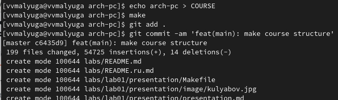
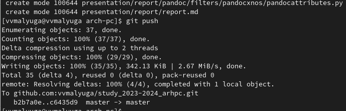

---
## Front matter
title: "Отчет по лабораторной работе №2"
subtitle: "Дисциплина: Архитектура компьютера"
author: "Малюга Валерия Васильевна"

## Generic otions
lang: ru-RU
toc-title: "Содержание"

## Bibliography
bibliography: bib/cite.bib
csl: pandoc/csl/gost-r-7-0-5-2008-numeric.csl

## Pdf output format
toc: true # Table of contents
toc-depth: 2
lof: true # List of figures
lot: true # List of tables
fontsize: 12pt
linestretch: 1.5
papersize: a4
documentclass: scrreprt
## I18n polyglossia
polyglossia-lang:
  name: russian
  options:
	- spelling=modern
	- babelshorthands=true
polyglossia-otherlangs:
  name: english
## I18n babel
babel-lang: russian
babel-otherlangs: english
## Fonts
mainfont: PT Serif
romanfont: PT Serif
sansfont: PT Sans
monofont: PT Mono
mainfontoptions: Ligatures=TeX
romanfontoptions: Ligatures=TeX
sansfontoptions: Ligatures=TeX,Scale=MatchLowercase
monofontoptions: Scale=MatchLowercase,Scale=0.9
## Biblatex
biblatex: true
biblio-style: "gost-numeric"
biblatexoptions:
  - parentracker=true
  - backend=biber
  - hyperref=auto
  - language=auto
  - autolang=other*
  - citestyle=gost-numeric
## Pandoc-crossref LaTeX customization
figureTitle: "Рис."
tableTitle: "Таблица"
listingTitle: "Листинг"
lofTitle: "Список иллюстраций"
lotTitle: "Список таблиц"
lolTitle: "Листинги"
## Misc options
indent: true
header-includes:
  - \usepackage{indentfirst}
  - \usepackage{float} # keep figures where there are in the text
  - \floatplacement{figure}{H} # keep figures where there are in the text
---

# Цель работы

	Целью работы является изучить идеологию и применение средств контроля версий. Приобрести практические навыки по работе с системой git.

# Задание

1. Настройка GitHub.
2. Базовая настройка Git.
3. Создание SSH-ключа.
4. Создание рабочего пространства и репозитория курса на основе шаблона.
5. Создание репозитория курса на основе шаблона.
6. Настройка каталога курса.
7. Выполнение заданий для самостоятельной работы.
# Теоретическое введение

	Системы контроля версий (Version Control System, VCS) применяются при работе нескольких человек над одним проектом. Обычно основное дерево проекта хранится в локальном или удалённом репозитории, к которому настроен доступ для участников проекта. При внесении изменений в содержание проекта система контроля версий позволяет их фиксировать, совмещать изменения, произведённые разными участниками проекта, производить откат к любой более ранней версии проекта, если это требуется.
	В классических системах контроля версий используется централизованная модель, предполагающая наличие единого репозитория для хранения файлов. Участник проекта (пользователь) перед началом работы посредством определённых команд получает нужную ему версию файлов. После внесения изменений пользователь размещает новую версию в хранилище. При этом предыдущие версии не удаляются из центрального хранилища и к ним можно вернуться в любой момент. Системы контроля версий поддерживают возможность отслеживания и разрешения конфликтов, которые могут возникнуть при работе нескольких человек над одним файлом. Можно объединить (слить) изменения, сделанные разными участниками (автоматически или вручную), вручную выбрать нужную версию, отменить изменения вовсе или заблокировать файлы для изменения.
	Системы контроля версий также могут обеспечивать дополнительные, более гибкие функциональные возможности. Например, они могут поддерживать работу с несколькими версиями одного файла, сохраняя общую историю изменений до точки ветвления версий и собственные истории изменений каждой ветви. Кроме того, обычно доступна информация о том, кто из участников, когда и какие изменения вносил.
	В отличие от классических, в распределённых системах контроля версий центральный репозиторий не является обязательным.
	Система контроля версий Git представляет собой набор программ командной строки. Доступ к ним можно получить из терминала посредством ввода команды git с различными опциями. Благодаря тому, что Git является распределённой системой контроля версий, резервную копию локального хранилища можно сделать простым копированием или архивацией.
	
: Основные команды git{#tbl:std-dir}

| Команда | Описание                                                                                                           |
|--------------|----------------------------------------------------------------------------------------------------------------------------|
| `git init`          | создание основного дерева репозитория                                                            |
| `git pull `      | получение обновлений (изменений) текущего дерева из центрального репозитория     |
| `git push`       | отправка всех произведённых изменений локального дерева в центральный репозиторий                                           |
| `git status`      | просмотр списка изменённых файлов в текущей директории |
| `git diff`     | просмотр текущих изменения                                                                                   |
| `git add`      | добавить все изменённые и/или созданные файлы и/или каталоги                                                                                     |
| `git add имена_файлов`       | добавить конкретные изменённые и/или созданные файлы и/или каталоги                                                                                                            |
| `git rm имена_файлов`       | удалить файл и/или каталог из индекса репозитория (при этом файл и/или каталог остаётся в локальной директории)                                                                                 |
| `git commit -am 'Описание коммита'`      | сохранить все добавленные изменения и все изменённые файлы |
| `git checkout -b имя_ветки`      | создание новой ветки, базирующейся на текущей |
| `git checkout имя_ветки`      | переключение на некоторую ветку (при переключении на ветку, которой ещё нет в локальном репозитории, она будет создана и связана с удалённой) |
| `git push origin имя_ветки`      | отправка изменений конкретной ветки в центральный репозиторий |
| `git merge --no-ff имя_ветки`      | слияние ветки с текущим деревом |
| `git branch -d имя_ветки`      | удаление локальной уже слитой с основным деревом ветки |
| `git branch -D имя_ветки`      | принудительное удаление локальной ветки |
| `git push origin :имя_ветки`      | удаление ветки с центрального репозитория |

# Выполнение лабораторной работы

## Настройка GitHub

Создала учетную запись на сайте https://github.com/(рис. [-@fig:001]).

{#fig:001 width=70%}

## Базовая настройка Git

Открыла терминал и ввела следующие команды, указав мои имя и email. Настроила utf-8 в выводе сообщений git. Задала имя начальной ветки (master) и параметры autocrlf, safecrlf (рис. [-@fig:002]).

{#fig:002 width=70%}

## Создание SSH-ключа

Сгенерировала пару ключей (приватный и открытый) (рис. [-@fig:003]). Просмотрела ключ с помощью команды cat, скопировала его, вставила в поле для ключа на сайте (рис. [-@fig:004]). Авторизовала ключ (рис. [-@fig:005]).

{#fig:003 width=70%}

{#fig:004 width=70%}

{#fig:005 width=70%}

## Создание рабочего пространства и репозитория курса на основе шаблона

Открыла терминал и создала каталог для предмета «Архитектура компьютера». Проверила с помощью команды ls (рис. [-@fig:006]).

{#fig:006 width=70%}

## Создание репозитория курса на основе шаблона

Перехожу на страницу репозитория с шаблоном курса https://github.com/yamadharma/course-directory-student-template. Далее выбрала Use this template (рис. [-@fig:007]). В открывшемся окне задала имя репозитория study_2023–2024_arhpc и создала репозиторий (рис. [-@fig:008]).

{#fig:007 width=70%}

{#fig:008 width=70%}

Открыла терминал и перешла в каталог курса. Клонировала созданный репозиторий, скопировав ссылку для клонирования на странице созданного репозитория Code -> SSH (рис. [-@fig:009]).

{#fig:009 width=70%}

## Настройка каталога курса

Перешла в каталог курса, удалила лишние файлы с помощью команды rm (рис. [-@fig:010]).

{#fig:010 width=70%}

Создала необходимые каталоги с помощью git add, комментирую и сохраняю изменения на сервере как добавление курса с помощью git commit (рис. [-@fig:011]). Отправила файлы на сервер с помощью push (рис. [-@fig:012]). Проверила правильность создания иерархии рабочего пространства в локальном репозитории и на странице github (рис. [-@fig:013]).

{#fig:011 width=70%}

{#fig:012 width=70%}

{#fig:013 width=70%}

## Выполнение заданий для самостоятельной работы

1. Перехожу в директорию labs/lab02/report с помощью утилиты cd. Создаю в каталоге файл для отчета по второй лабораторной работе с помощью утилиты touch (рис. [-@fig:014]).

{#fig:014 width=70%}

	Оформляю отчет по лабораторной работе №2 в текстовом процессоре LibreOffice Writer.

2. Первая лабораторная работа у меня находится в подкаталоге домашней директори Downloads. Перехожу в каталог [...]/arch-pc/labs/lab01/report и копирую сюда файл Л01_Малюга_отчет.pdf с помощью команды cp и проверяю выполнение с помощью ls (рис. [-@fig:015]).

{#fig:015 width=70%}

3. Перешла в каталог arch-pc, чтобы отправить все добавленные файлы в репозиторий. Использую      команды git add (добавляю все измененные файлы), и затем git commit -m «Add existing files» (сохраняю все измененные файлы), и в конце git push, чтобы отправить все изменения на сервер (рис. [-@fig:016]).

{#fig:016 width=70%}

Проверила выполнение работы на сайте github. Действительно, все добавилось (рис. [-@fig:017]).

{#fig:017 width=70%}

# Выводы

	Изучила идеологию и средства контроля версий, также приобрела практические навыки по работе с системой git.

