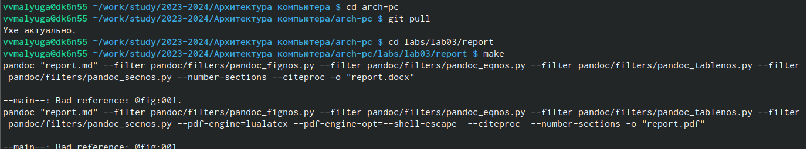
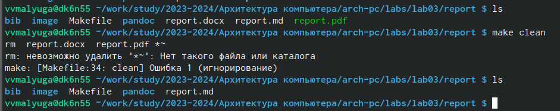
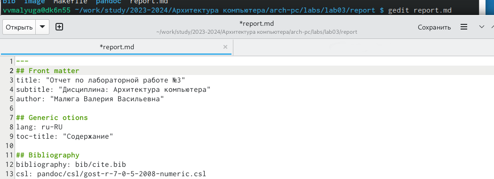
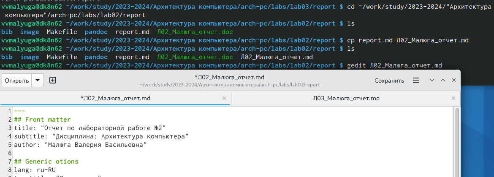
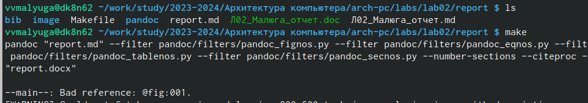
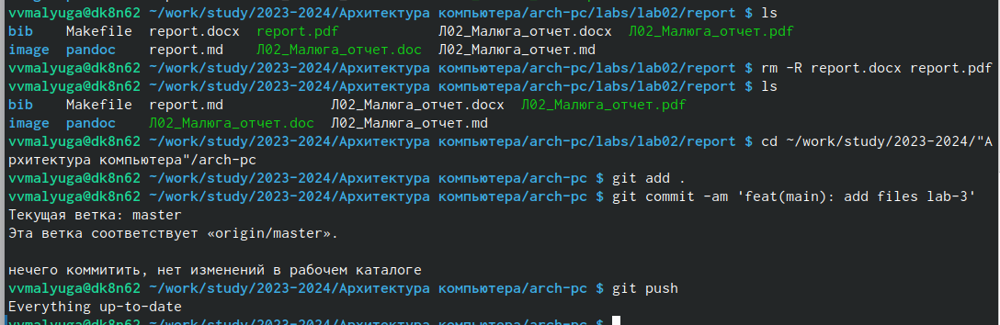

---
## Front matter
title: "Отчет по лабораторной работе №3"
subtitle: "Дисциплина: Архитектура компьютера"
author: "Малюга Валерия Васильевна"

## Generic otions
lang: ru-RU
toc-title: "Содержание"

## Bibliography
bibliography: bib/cite.bib
csl: pandoc/csl/gost-r-7-0-5-2008-numeric.csl

## Pdf output format
toc: true # Table of contents
toc-depth: 2
lof: true # List of figures
lot: true # List of tables
fontsize: 12pt
linestretch: 1.5
papersize: a4
documentclass: scrreprt
## I18n polyglossia
polyglossia-lang:
  name: russian
  options:
	- spelling=modern
	- babelshorthands=true
polyglossia-otherlangs:
  name: english
## I18n babel
babel-lang: russian
babel-otherlangs: english
## Fonts
mainfont: PT Serif
romanfont: PT Serif
sansfont: PT Sans
monofont: PT Mono
mainfontoptions: Ligatures=TeX
romanfontoptions: Ligatures=TeX
sansfontoptions: Ligatures=TeX,Scale=MatchLowercase
monofontoptions: Scale=MatchLowercase,Scale=0.9
## Biblatex
biblatex: true
biblio-style: "gost-numeric"
biblatexoptions:
  - parentracker=true
  - backend=biber
  - hyperref=auto
  - language=auto
  - autolang=other*
  - citestyle=gost-numeric
## Pandoc-crossref LaTeX customization
figureTitle: "Рис."
tableTitle: "Таблица"
listingTitle: "Листинг"
lofTitle: "Список иллюстраций"
lotTitle: "Список таблиц"
lolTitle: "Листинги"
## Misc options
indent: true
header-includes:
  - \usepackage{indentfirst}
  - \usepackage{float} # keep figures where there are in the text
  - \floatplacement{figure}{H} # keep figures where there are in the text
---

# Цель работы

Целью работы является освоение процедуры оформления отчетов с помощью легковесного языка разметки Markdown.

# Задание

1. Установка необходимого ПО
2. Заполнение отчета по выполнению лабораторной работы №4 с помощью языка разметки Markdown
3. Задание для самостоятельной работы

# Теоретическое введение

	Markdown - легковесный язык разметки, созданный с целью обозначения форматирования в простом тексте, с максимальным сохранением его читаемости человеком, и пригодный для машинного преобразования в языки для продвинутых публикаций. 
	Внутритекстовые формулы делаются аналогично формулам LaTeX.
В Markdown вставить изображение в документ можно с помощью непосредственного указания адреса изображения.
Синтаксис Markdown для встроенной ссылки состоит из части [link text], представляющей текст гиперссылки, и части (file-name.md) – URL-адреса или имени файла, на который дается ссылка.
	Markdown поддерживает как встраивание фрагментов кода в предложение, так и их размещение между предложениями в виде отдельных огражденных блоков. Огражденные блоки кода — это простой способ выделить синтаксис для фрагментов кода.

# Выполнение лабораторной работы
## Установка необходимого ПО

	Так как я выполняю работу в дисплейном классе, установка дополнительного программного обеспечения не требуется.
 
## Заполнение отчета по выполнению лабораторной работы №4 с помощью языка разметки Markdown

	Открыла терминал, перешла в каталог курса, сформированный при выполнении лабораторной работы №2. Обновила локальный репозиторий, скачав изменения из удаленного репозиторий с помощью команды git pull. Перешла в каталог с шаблоном отчета по лабораторной работе №3, провела компиляцию шаблона с использованием Makefile с помощью команды make (рис. 1]).

{ #fig:fig001 width=70% }

	Проверила выполнение компиляции с помощью ls. Действительно, успешно создались файлы report.pdf и report.docx. Теперь удаляю созданные файлы с помощью make clean, проверила с помощью ls (рис. 2).

{ #fig:fig002 width=70% }

	Открыла файл report.md с помощью текстового редактора gedit и начала выполнять работу по написанию отчета к лабораторной работе №3 (рис. 3).

{ #fig:003 width=70% }

## Задание для самостоятельной работы

1. Перешла в директорию lab02/report, чтобы здесь заполнить отчет по второй лабораторной работе. Скопировала файл report.md и переименовала его в Л02_Малюга__отчет.md. Сделала отчет по второй лабораторной работе в формате Markdown (рис. 4).

{ #fig:004 width=70% }

2. Компилирую файл с отчетом по лабораторной работе (рис. 5). Удаляю лишние сгенерированные файлы report.docx и report.pdf. Добавляю изменения на GitHub с помощью комнадой git add и сохраняю изменения с помощью commit. Отправлялю файлы на сервер с помощью команды git pull (рис. 6).

{ #fig:005 width=70% }

{ #fig:006 width=70% }

# Выводы

	В результате выполнения данной лабораторной работы я освоила процедуры оформления отчетов с помощью легковесного языка разметки Markdown.

