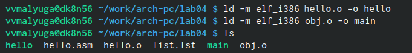

---
## Front matter
title: "Лабораторная работа №4"
subtitle: "Дисциплина: Архитектура компьютера"
author: "Малюга Валерия Васильевна"

## Generic otions
lang: ru-RU
toc-title: "Содержание"

## Bibliography
bibliography: bib/cite.bib
csl: pandoc/csl/gost-r-7-0-5-2008-numeric.csl

## Pdf output format
toc: true # Table of contents
toc-depth: 2
lof: true # List of figures
lot: true # List of tables
fontsize: 12pt
linestretch: 1.5
papersize: a4
documentclass: scrreprt
## I18n polyglossia
polyglossia-lang:
  name: russian
  options:
	- spelling=modern
	- babelshorthands=true
polyglossia-otherlangs:
  name: english
## I18n babel
babel-lang: russian
babel-otherlangs: english
## Fonts
mainfont: PT Serif
romanfont: PT Serif
sansfont: PT Sans
monofont: PT Mono
mainfontoptions: Ligatures=TeX
romanfontoptions: Ligatures=TeX
sansfontoptions: Ligatures=TeX,Scale=MatchLowercase
monofontoptions: Scale=MatchLowercase,Scale=0.9
## Biblatex
biblatex: true
biblio-style: "gost-numeric"
biblatexoptions:
  - parentracker=true
  - backend=biber
  - hyperref=auto
  - language=auto
  - autolang=other*
  - citestyle=gost-numeric
## Pandoc-crossref LaTeX customization
figureTitle: "Рис."
tableTitle: "Таблица"
listingTitle: "Листинг"
lofTitle: "Список иллюстраций"
lolTitle: "Листинги"
## Misc options
indent: true
header-includes:
  - \usepackage{indentfirst}
  - \usepackage{float} # keep figures where there are in the text
  - \floatplacement{figure}{H} # keep figures where there are in the text
---

# Цель работы

Цель данной лабораторной работы - освоить процедуры компиляции и сборки программ, написанных на ассемблере NASM.

# Задание

1. Создание программы Hello world!
2. Работа с транслятором NASM
3. Работа с расширенным синтаксисом командной строки NASM
4. Работа с компоновщиком LD
5. Запуск исполняемого файла
6. Выполнение заданий для самостоятельной работы.

# Теоретическое введение

## Основные принципы работы компьютера
Основными функциональными элементами любой электронно-вычислительной машины (ЭВМ) являются центральный процессор, память и периферийные устройства. Взаимодействие этих устройств осуществляется через общую шину, к которой они подключены. В современных компьютерах проводники выполнены в виде электропроводящих дорожек на материнской (системной) плате.
Основной задачей процессора является обработка информации, а также организация координации всех узлов компьютера. В состав **центрального процессора (ЦП)** входят следующие устройства:
• **арифметико-логическое устройство (АЛУ)** — выполняет логические и арифметические действия, необходимые для обработки информации, хранящейся в памяти;
• **устройство управления (УУ)** — обеспечивает управление и контроль всех устройств компьютера;
• **регистры** — сверхбыстрая оперативная память небольшого объёма, входящая в состав процессора, для временного хранения промежуточных результатов выполнения инструкций; регистры процессора делятся на два типа: регистры общего назначения и специальные регистры.
Для того, чтобы писать программы на ассемблере, необходимо знать, какие регистры процессора существуют и как их можно использовать. Практически все команды представляют собой преобразование данных хранящихся в регистрах процессора, это например пересылка данных между регистрами или между регистрами и памятью, преобразование (арифметические или логические операции) данных хранящихся в регистрах.
Доступ к регистрам осуществляется не по адресам, как к основной памяти, а по именам. Каждый регистр процессора архитектуры x86 имеет свое название, состоящее из 2 или 3 букв латинского алфавита.
Другим важным узлом ЭВМ является **оперативное запоминающее устройство (ОЗУ)**. ОЗУ — это быстродействующее энергозависимое запоминающее устройство, которое напрямую взаимодействует с узлами процессора, предназначенное для хранения программ и данных, с которыми процессор непосредственно работает в текущий момент. 
В состав ЭВМ также входят **периферийные устройства**, которые можно разделить на:
• ***устройства внешней памяти***, которые предназначены для долговременного хранения больших объёмов данных (жёсткие диски, твердотельные накопители, магнитные ленты);
• ***устройства ввода-вывода***, которые обеспечивают взаимодействие ЦП с внешней средой.
В основе вычислительного процесса ЭВМ лежит **принцип программного управления**. Это означает, что компьютер решает поставленную задачу как последовательность действий, записанных в виде программы.
Набор машинных команд определяется устройством конкретного процессора. В коде машинной команды можно выделить две части: *операционную* и *адресную*. В операционной части хранится код команды, которую необходимо выполнить. В адресной части хранятся данные или адреса данных, которые участвуют в выполнении данной операции.
При выполнении каждой команды процессор выполняет определённую последовательность стандартных действий, которая называется **командным циклом процессора**. В общем виде он заключается в следующем:
1. формирование адреса в памяти очередной команды;
2. считывание кода команды из памяти и её дешифрация;
3. выполнение команды;
4. переход к следующей команде.

## Ассемблер и язык ассемблера

**Язык ассемблера** (assembly language, сокращённо asm) — машинно-ориентированный язык низкого уровня. Можно считать, что он больше любых других языков приближен к архитектуре ЭВМ и её аппаратным возможностям, что позволяет получить к ним более полный доступ. В отличие от языков высокого уровня ассемблерная программа содержит только тот код, который ввёл программист. Таким образом язык ассемблера — это язык, с помощью которого понятным для человека образом пишутся команды для процессора.
Процессор понимает не команды ассемблера, а последовательности из нулей и единиц — **машинные коды**. Преобразование или *трансляция* команд с языка ассемблера в исполняемый машинный код осуществляется специальной программой транслятором — **Ассемблер**. Для каждой архитектуры существует свой ассемблер и, соответственно, свой язык ассемблера.
NASM — это открытый проект ассемблера, версии которого доступны под различные операционные системы и который позволяет получать объектные файлы для этих систем. В NASM используется Intel-синтаксис и поддерживаются инструкции x86-64.
Типичный формат записи команд NASM имеет вид:
[метка:] мнемокод [операнд {, операнд}] [; комментарий]
Здесь **мнемокод** — непосредственно мнемоника инструкции процессору, которая является
обязательной частью команды. **Операндами** могут быть числа, данные, адреса регистров или адреса оперативной памяти. **Метка** — это идентификатор, с которым ассемблер ассоциирует некоторое число, чаще всего адрес в памяти. Т.о. метка перед командой связана с адресом данной команды.
Программа на языке ассемблера также может содержать **директивы** — инструкции, не переводящиеся непосредственно в машинные команды, а управляющие работой транслятора. Например, директивы используются для определения данных (констант и переменных) и обычно пишутся большими буквами.
	
	
## Процесс создания и обработки программы на языке ассемблера

В процессе создания ассемблерной программы можно выделить четыре шага:
• **Набор текста** программы в текстовом редакторе и сохранение её в отдельном файле. Каждый файл имеет свой тип (или расширение), который определяет назначение файла. Файлы с исходным текстом программ на языке ассемблера имеют тип asm.
• **Трансляция** — преобразование с помощью транслятора, например nasm, текста программы в машинный код, называемый объектным. На данном этапе также может быть получен листинг программы, содержащий кроме текста программы различную дополнительную информацию, созданную транслятором. Тип объектного файла — o, файла листинга — lst.
• **Компоновка или линковка** — этап обработки объектного кода компоновщиком (ld), который принимает на вход объектные файлы и собирает по ним исполняемый файл. Исполняемый файл обычно не имеет расширения. Кроме того, можно получить файл карты загрузки программы в ОЗУ, имеющий расширение map.
• **Запуск программы**. Конечной целью является работоспособный исполняемый файл. Ошибки на предыдущих этапах могут привести к некорректной работе программы, поэтому может присутствовать этап отладки программы при помощи специальной программы — отладчика. При нахождении ошибки необходимо провести коррекцию программы, начиная с первого шага.

# Выполнение лабораторной работы 

## Создание программы Hello world!

Создаю каталог для работы с программами на языке ассемблера NASM. Перешла в созданный каталог, создала текстовый файл с именем hello.asm. Открыла этот файл с помощью текстового редактора gedit и ввела в него необходимый текст (рис. @fig:001).
	
{#fig:001 width=70%}

## Работа с транслятором NASM

Для компиляции программы "Hello world" написала в терминале команду nasm -f elf hello.asm. Впоследствии проверила выполнение этой команды с помощью ls. Действительно, транслятор преобразовал hello.asm в hello.o (рис. @fig:002).
	
{#fig:002 width=70%}

## Работа с расширенным синтаксисом командной строки NASM

Ввела команду, которая скомпилировала файл hello.asm в файл obj.o, при этом в файл были включены символы для отладки (ключ -g), также с помощью ключа -l был создан файл листинга list.lst. Далее проверила с помощью утилиты ls правильность выполнения команды (рис. [-@fig:003]).

{ #fig:003 width=70% }

##  Работа с компоновщиком LD

Передала объектный файл на обработку компоновщику, чтобы получить исполняемую программу. Выполнила команду ld -m elf_i386 obj.o -o main. Исполняемый файл будет иметь имя main, т.к. после ключа -о было задано значение main. Объектный файл, из которого собран этот исполняемый файл, имеет имя obj.o (рис. [-@fig:004]).

{ #fig:004 width=70% }

## Запуск исполняемого файла

Запустила созданный исполняемый файл, набрав в терминале команду (рис. [-@fig:005]).
	
{ #fig:005 width=70% }

## Выполнение заданий для самостоятельной работы

1. В каталоге ~/work/arch-pc/lab04 с помощью команды cp создала копию файла hello.asm с именем lab4.asm (рис. [-@fig:006]).

2. С помощью текстового редактора gedit внесла изменения в текст программы в файле lab4.asm так, чтобы вместо Hello world! на экран выводилась строка с моими фамилией и именем (рис. [-@fig:006]).

{ #fig:006 width=70% }

3. Оттранслировала полученный текст программы lab4.asm в объектный файл. Выполнила компоновку объектного файла и запустила получившийся исполняемый файл (рис. [-@fig:007]).

{ #fig:007 width=70% }

4. Скопировала файлы hello.asm и lab4.asm в локальный репозиторий в каталог ~/work/study/2023-2024/"Архитектура компьютера"/arch-pc/labs/lab04/. Загрузила файлы на Github (рис. [-@fig:008]).

{ #fig:008 width=70% }

# Выводы

При выполнении данной лабораторной работы я освоила процедуры компиляции и сборки программ, написанных на ассемблере NASM.

