---
## Front matter
title: "Лабораторная работа №6"
subtitle: "Дисциплина: Архитектура компьютера"
author: "Малюга Валерия Васильевна"

## Generic otions
lang: ru-RU
toc-title: "Содержание"

## Bibliography
bibliography: bib/cite.bib
csl: pandoc/csl/gost-r-7-0-5-2008-numeric.csl

## Pdf output format
toc: true # Table of contents
toc-depth: 2
lof: true # List of figures
fontsize: 12pt
linestretch: 1.5
papersize: a4
documentclass: scrreprt
## I18n polyglossia
polyglossia-lang:
  name: russian
  options:
	- spelling=modern
	- babelshorthands=true
polyglossia-otherlangs:
  name: english
## I18n babel
babel-lang: russian
babel-otherlangs: english
## Fonts
mainfont: PT Serif
romanfont: PT Serif
sansfont: PT Sans
monofont: PT Mono
mainfontoptions: Ligatures=TeX
romanfontoptions: Ligatures=TeX
sansfontoptions: Ligatures=TeX,Scale=MatchLowercase
monofontoptions: Scale=MatchLowercase,Scale=0.9
## Biblatex
biblatex: true
biblio-style: "gost-numeric"
biblatexoptions:
  - parentracker=true
  - backend=biber
  - hyperref=auto
  - language=auto
  - autolang=other*
  - citestyle=gost-numeric
## Pandoc-crossref LaTeX customization
figureTitle: "Рис."
tableTitle: "Таблица"
listingTitle: "Листинг"
lofTitle: "Список иллюстраций"
lolTitle: "Листинги"
## Misc options
indent: true
header-includes:
  - \usepackage{indentfirst}
  - \usepackage{float} # keep figures where there are in the text
  - \floatplacement{figure}{H} # keep figures where there are in the text
---

# Цель работы

  Освоение арифметических инструкций языка ассемблера NASM.  

# Задание

1. Символьные и численные данные в NASM  
2. Выполнение арифметических операций в NASM  
3. Выполнение заданий для самостоятельной работы  


# Теоретическое введение

  Большинство инструкций на языке ассемблера требуют обработки операндов. Адрес операнда предоставляет место, где хранятся данные, подлежащие обработке. Это могут быть данные хранящиеся в регистре или в ячейке памяти.   

- Регистровая адресация – операнды хранятся в регистрах и в команде используются имена этих регистров, например: mov ax,bx.  
- Непосредственная адресация – значение операнда задается непосредственно в команде, Например: mov ax,2.  
- Адресация памяти – операнд задает адрес в памяти. В команде указывается символическое обозначение ячейки памяти, над содержимым которой требуется выполнить операцию.  

  Ввод информации с клавиатуры и вывод её на экран осуществляется в символьном виде. Кодирование этой информации производится согласно кодовой таблице символов ASCII. ASCII – сокращение от American Standard Code for Information Interchange (Американский стандартный код для обмена информацией). Согласно стандарту ASCII каждый символ кодируется одним байтом.  
  Среди инструкций NASM нет такой, которая выводит числа (не в символьном виде). Поэтому, например, чтобы вывести число, надо предварительно преобразовать его цифры в ASCII-коды этих цифр и выводить на экран эти коды, а не само число. Если же выводить число на экран непосредственно, то экран воспримет его не как число, а как последовательность ASCII-символов – каждый байт числа будет воспринят как один ASCII-символ – и выведет на экран эти символы.  
  Аналогичная ситуация происходит и при вводе данных с клавиатуры. Введенные данные будут представлять собой символы, что сделает невозможным получение корректного результата при выполнении над ними арифметических операций.  
  Для решения этой проблемы необходимо проводить преобразование ASCII символов в числа и обратно.  

# Выполнение лабораторной работы

## Символьные и численные данные в NASM

  С помощью утилиты mkdir создала каталог для программам лабораторной работы № 6, перешла в него и создала файл lab6-1.asm Скопировала в текущий каталог файл in_out.asm с помощью утилиты cp, т.к. он будет использоваться в других программах (рис. @fig:001).  

{ #fig:001 width=70% }  

  Ввела в файл lab6-1.asm текст программы из листинга 6.1 (рис. @fig:002).  

{ #fig:002 width=70% }  

  Создала исполняемый файл и запустила его (рис. @fig:003). Вывод программы: символ j, потому что программа вывела символ, соответствующий по системе ASCII сумме двоичных кодов символов 4 и 6.  

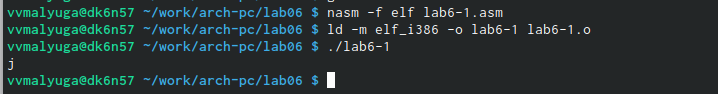{ #fig:003 width=70% }  

   Исправила текст программы: поменяла символы "6" и "4" на цифры 6 и 4 (рис. @fig:004). Создала исполняемый файл и запустила его (рис. @fig:005). Теперь вывелся символ с кодом 10, это символ перевода строки, этот символ не отображается при выводе на экран.  

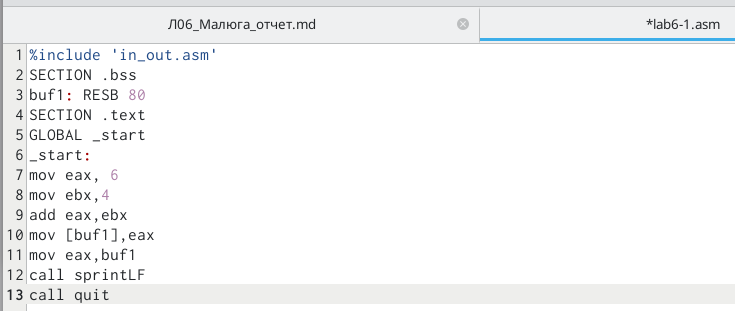{ #fig:004 width=70% }  

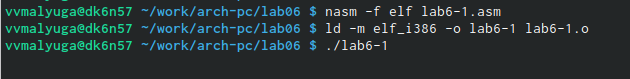{ #fig:005 width=70% }  

  Создала файл lab6-2.asm в каталоге ~/work/arch-pc/lab06 и ввела в него текст программы из листинга 6.2 (рис. @fig:006).  

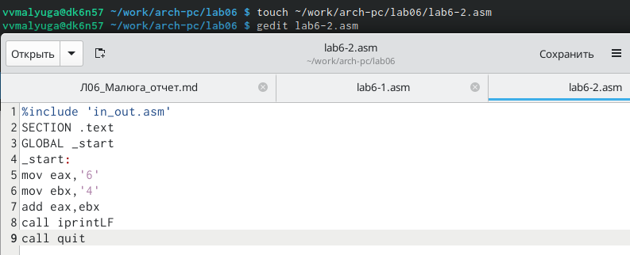{ #fig:006 width=70% }  

  Создала исполняемый файл и запустила его (рис. @fig:007). Теперь вывод число 106, потому что программа позволяет вывести именно число, а не символ, хотя все еще происходит именно сложение кодов символов "6" и "4".  

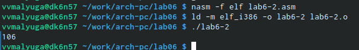{ #fig:007 width=70% }  

  Заменила в тексте программы в файле lab6-2.asm символы "6" и "4" на числа 6 и 4 (рис. @fig:008).  
  
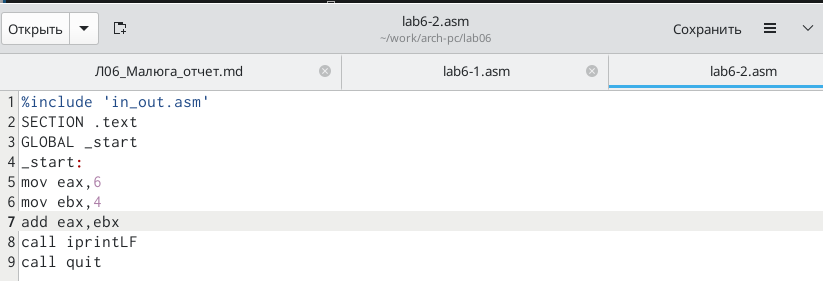{ #fig:008 width=70% }  

  Создала  и запустила новый исполняемый файл (рис. @fig:009). Теперь программа складывает не соответствующие символам коды в системе ASCII, а сами числа, поэтому вывод 10.  
  
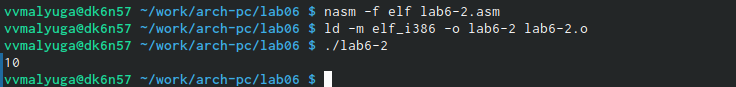{ #fig:009 width=70% }  

  Заменяю в тексте программы функцию iprintLF на iprint (рис. @fig:010). Создала и запустила новый исполняемый файл (рис. @fig:010). Вывод не изменился потому что символ переноса строки не отображался, когда программа исполнялась с функцией iprintLF, а iprint не добавляет к выводу символ переноса строки, в отличие от iprintLF.   

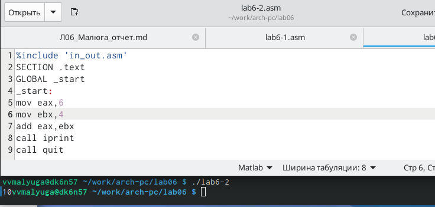{ #fig:010 width=70% }


## Выполнение арифметических операций в NASM

  Создала файл lab6-3.asm с помощью утилиты touch (рис. @fig:011). Ввела в созданный файл текст программы для вычисления значения выражения f(x) = (5 * 2 + 3)/3 (рис. @fig:011).  

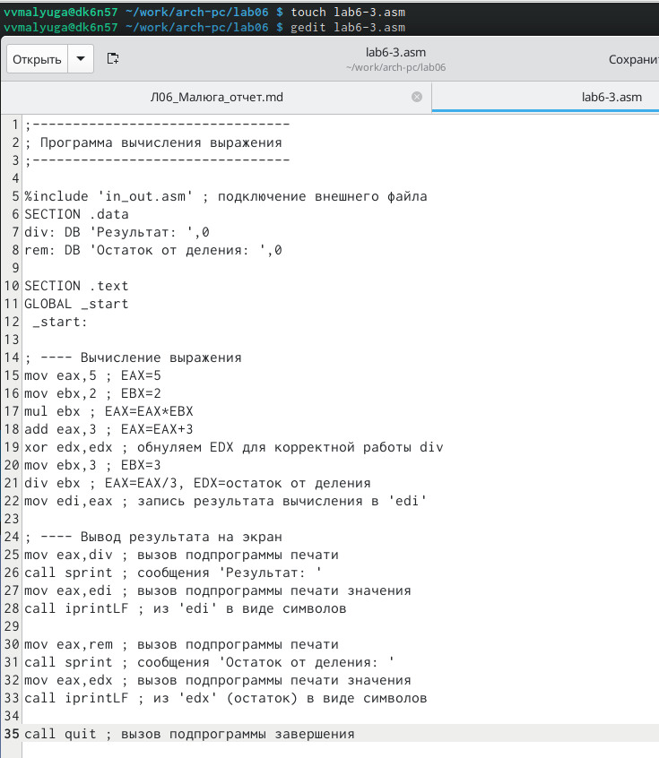{ #fig:011 width=70% }  

  Создала исполняемый файл и запустила его (рис. [-@fig:012]).  

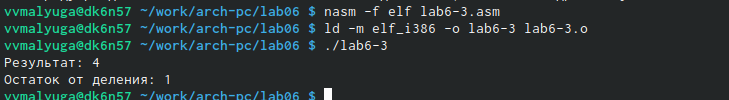{ #fig:012 width=70% }  

  Изменила программу так, чтобы она вычисляла значение выражения f(x) = (4 * 6 + 2)/5 (рис. @fig:013). Создала и запустила новый исполняемый файл (рис. @fig:013). Программа отработала верно.  

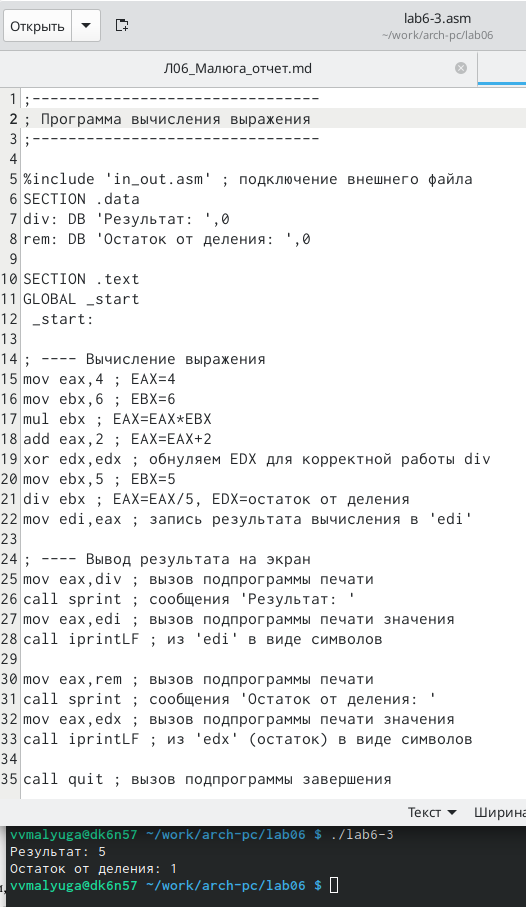{ #fig:013 width=70% }  

  Создала файл variant.asm с помощью утилиты touch. Ввела в файл текст из листинга 6.4. Создала исполняемый файл и запустила его. Ввела номер своего студенческого билета и получила номер своего варианта -- 11 (рис. @fig:014). Проверила правильность выполнения, вычислив номер варианта аналитически.  

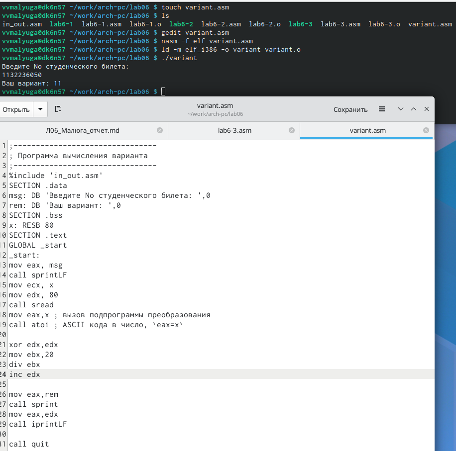{ #fig:014 width=70% }  

### Ответы на вопросы по программе

1. За вывод сообщения "Ваш вариант" отвечают строки кода:

```NASM
mov eax,rem
call sprint
```

2. Инструкция mov ecx, x используется, чтобы положить адрес вводимой строки x в регистр ecx  
  mov edx, 80 - запись в регистр edx длины вводимой строки   
  call sread - вызов подпрограммы из внешнего файла, обеспечивающей ввод сообщения с клавиатуры  

3. call atoi используется для вызова подпрограммы из внешнего файла, которая преобразует ascii-код символа в целое число и записывает результат в регистр eax  

4. За вычисления варианта отвечают строки:  

```NASM
xor edx,edx ; обнуление edx для корректной работы div
mov ebx,20 ; ebx = 20
div ebx ; eax = eax/20, edx - остаток от деления
inc edx ; edx = edx + 1
```

5. При выполнении инструкции div ebx остаток от деления записывается в регистр edx  

6. Инструкция inc edx увеличивает значение регистра edx на 1  

7. За вывод на экран результатов вычислений отвечают строки:

```NASM
mov eax,edx
call iprintLF
```

## Выполнение заданий для самостоятельной работы

  Создала файл zadanie.asm. Открыла его для редактирования, ввела в него текст программы для вычисления значения выражения 10*(x + 1)-10 (вариант 11). Создала и запустила исполняемый файл. При вводе значения 1 на входе вывод программы = 10. При вводе значения 7 на входе вывод программы = 70. Значит, программа работает верно. (рис. @fig:015).  

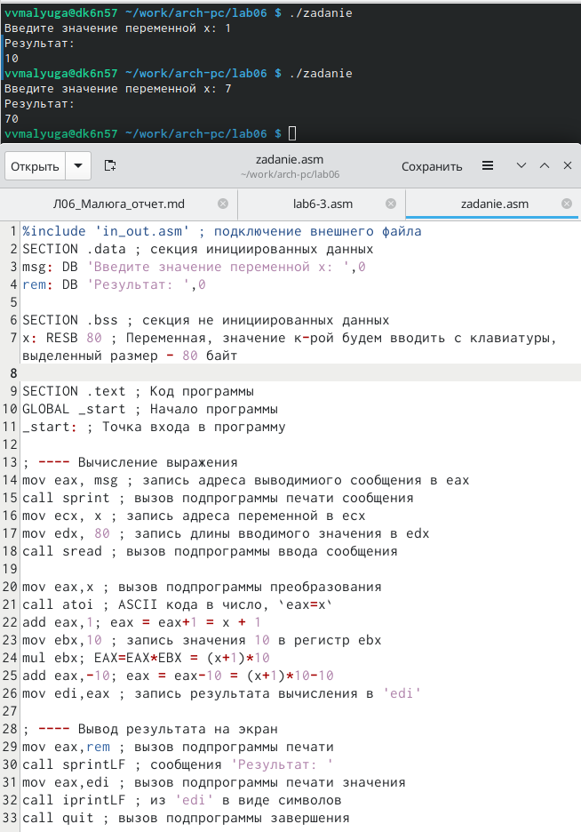{ #fig:015 width=70% }  

**Программа для вычисления значения выражения 10 * (x + 1) - 10.**

```NASM
%include 'in_out.asm' ; подключение внешнего файла
SECTION .data ; секция инициированных данных
msg: DB 'Введите значение переменной х: ',0
rem: DB 'Результат: ',0

SECTION .bss ; секция не инициированных данных
x: RESB 80 ; Переменная, значение к-рой будем вводить с клавиатуры, выделенный размер - 80 байт

SECTION .text ; Код программы
GLOBAL _start ; Начало программы
_start: ; Точка входа в программу

; ---- Вычисление выражения
mov eax, msg ; запись адреса выводимиого сообщения в eax
call sprint ; вызов подпрограммы печати сообщения
mov ecx, x ; запись адреса переменной в ecx
mov edx, 80 ; запись длины вводимого значения в edx
call sread ; вызов подпрограммы ввода сообщения

mov eax,x ; вызов подпрограммы преобразования
call atoi ; ASCII кода в число, `eax=x`
add eax,1; eax = eax+1 = x + 1
mov ebx,10 ; запись значения 10 в регистр ebx
mul ebx; EAX=EAX*EBX = (x+1)*10
add eax,-10; eax = eax-10 = (x+1)*10-10
mov edi,eax ; запись результата вычисления в 'edi'

; ---- Вывод результата на экран
mov eax,rem ; вызов подпрограммы печати
call sprintLF ; сообщения 'Результат: '
mov eax,edi ; вызов подпрограммы печати значения
call iprintLF ; из 'edi' в виде символов
call quit ; вызов подпрограммы завершения
```


# Выводы

  При выполнении данной лабораторной работы я освоила арифметические инструкции языка ассемблера NASM.
  
# Список литературы

1. [Лабораторная работа №7](https://esystem.rudn.ru/pluginfile.php/1584637/mod_resource/content/1/%D0%9B%D0%B0%D0%B1%D0%BE%D1%80%D0%B0%D1%82%D0%BE%D1%80%D0%BD%D0%B0%D1%8F%20%D1%80%D0%B0%D0%B1%D0%BE%D1%82%D0%B0%20%E2%84%967.pdf)

