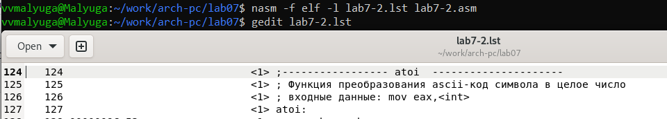

---
## Front matter
title: "Лабораторная работа №7"
subtitle: "Дисциплина: Архитектура компьютера"
author: "Малюга Валерия Васильевна"

## Generic otions
lang: ru-RU
toc-title: "Содержание"

## Bibliography
bibliography: bib/cite.bib
csl: pandoc/csl/gost-r-7-0-5-2008-numeric.csl

## Pdf output format
toc: true # Table of contents
toc-depth: 2
lof: true # List of figures
fontsize: 12pt
linestretch: 1.5
papersize: a4
documentclass: scrreprt
## I18n polyglossia
polyglossia-lang:
  name: russian
  options:
	- spelling=modern
	- babelshorthands=true
polyglossia-otherlangs:
  name: english
## I18n babel
babel-lang: russian
babel-otherlangs: english
## Fonts
mainfont: PT Serif
romanfont: PT Serif
sansfont: PT Sans
monofont: PT Mono
mainfontoptions: Ligatures=TeX
romanfontoptions: Ligatures=TeX
sansfontoptions: Ligatures=TeX,Scale=MatchLowercase
monofontoptions: Scale=MatchLowercase,Scale=0.9
## Biblatex
biblatex: true
biblio-style: "gost-numeric"
biblatexoptions:
  - parentracker=true
  - backend=biber
  - hyperref=auto
  - language=auto
  - autolang=other*
  - citestyle=gost-numeric
## Pandoc-crossref LaTeX customization
figureTitle: "Рис."
tableTitle: "Таблица"
listingTitle: "Листинг"
lofTitle: "Список иллюстраций"
lolTitle: "Листинги"
## Misc options
indent: true
header-includes:
  - \usepackage{indentfirst}
  - \usepackage{float} # keep figures where there are in the text
  - \floatplacement{figure}{H} # keep figures where there are in the text
---


# Цель работы

  Изучение команд условного и безусловного переходов. Приобретение навыков написания программ с использованием переходов. Знакомство с назначением и структурой файла листинга.  

# Задание

1. Реализация переходов в NASM.  
2. Изучение структуры файлы листинга.  
3. Задания для самостоятельной работы.  


# Теоретическое введение

  Для реализации ветвлений в ассемблере используются так называемые команды передачи управления или команды перехода. Можно выделить 2 типа переходов:  
  • условный переход – выполнение или не выполнение перехода в определенную точку программы в зависимости от проверки условия.  
  • безусловный переход – выполнение передачи управления в определенную точку программы без каких-либо условий.  
  Безусловный переход выполняется инструкцией jmp. Инструкция cmp является одной из инструкций, которая позволяет сравнить операнды и выставляет флаги в зависимости от результата сравнения.  
  Инструкция cmp является командой сравнения двух операндов и имеет такой же формат, как и команда вычитания.  
  Листинг (в рамках понятийного аппарата NASM) — это один из выходных файлов, создаваемых транслятором. Он имеет текстовый вид и нужен при отладке программы, так как кроме строк самой программы он содержит дополнительную информацию.  

# Выполнение лабораторной работы

## Реализация переходов в NASM

  Создала каталог для программ лабораторной работы № 7, перешла в него и создала файл lab7-1.asm (рис. @fig:001).  

{#fig:001 width=70%}  

  Скопировала файл in_out.asm, так как он будет использоваться в программах. Ввела в файл lab7-1.asm текст программы из листинга 7.1. (рис. @fig:002).  

{#fig:002 width=70%}  

  Создала исполняемый файл и запустила его (рис. @fig:004). Таким образом, использование инструкции jmp _label2 меняет порядок исполнения инструкций и позволяет выполнить инструкции начиная с метки _label2, пропустив вывод первого сообщения.  

{#fig:004 width=70%}  

  Изменила программу таким образом, чтобы она выводила сначала ‘Сообщение № 2’, потом ‘Сообщение № 1’ и завершала работу. Для этого изменила текст программы в соответствии с листингом 7.2. (рис. @fig:005).  

{#fig:005 width=70%}  

  Создала исполняемый файл и проверила его работу (рис. @fig:006).  

{#fig:006 width=70%}  

  Изменила текст программы, чтобы она выводила сначала ‘Сообщение № 3’, потом ‘Сообщение № 2’, 'Сообщение № 1’ и завершала работу. Создала исполняемый файл и проверила работу (рис. @fig:007). Прилагаю измененный код: 
  
```NASM
%include 'in_out.asm' ; подключение внешнего файла
SECTION .data
msg1: DB 'Сообщение № 1',0
msg2: DB 'Сообщение № 2',0
msg3: DB 'Сообщение № 3',0

SECTION .text
GLOBAL _start
 _start:
 
 jmp _label3     ; 
 
 _label1:
   mov eax, msg1 ; Вывод на экран строки
   call sprintLF ; 'Сообщение No 1'
   jmp _end
 _label2:
   mov eax, msg2 ; Вывод на экран строки
   call sprintLF ; 'Сообщение No 2'
   jmp _label1
 _label3:
   mov eax, msg3 ; Вывод на экран строки
   call sprintLF ; 'Сообщение No 3'
   jmp _label2   ; 
 _end:
   call quit ; вызов подпрограммы завершения
```

{#fig:007 width=70%}  
  
  Создала файл lab7-2.asm в каталоге ~/work/arch-pc/lab07. Изучила текст программы из листинга 7.3 и ввела в lab7-2.asm (рис. @fig:008).  

{#fig:008 width=70%}  
  
  Создала исполняемый файл и проверила его работу для разных значений B (рис. @fig:009).  

{#fig:009 width=70%}  

##  Изучение структуры файлы листинга

  Создала файл листинга для программы из файла lab7-2.asm. Открыла файл листинга lab7-2.lst с помощью gedit. Объясню содержимое трёх строк файла листинга (рис. @fig:010).  

{#fig:010 width=70%}  
  
  
  1. Строка 124: Эта строка служит в качестве разделителя, обозначающего начало блока, связанного с функцией atoi.  

  2. Строка 125: Эта строка предоставляет общее описание функции atoi. Она сообщает, что функция отвечает за преобразование ASCII-кода символа в целое число.  
  
  3. Строка 126: Эта строка содержит информацию о том, что входные данные для функции передаются с использованием инструкции mov eax, <int>.  

  Открыла файл с программой lab7-2.asm и в инструкции с двумя операндами удалить один операнд. Выполнила трансляцию с получением файла листинга (рис. @fig:011).  

{#fig:011 width=70%}  
  
  Выполнила трансляцию с получением файла листинга. На выходе я не получила ни одного файла из-за ошибки инструкции mov,(единственная в коде содержит два операнда) которая не может работать, имея только один операнд, из-за чего нарушается работа кода (рис. @fig:012).  

{#fig:012 width=70%}  

## Задание для самостоятельной работы

  1. Написала программу для нахождения наименьшей из 3 целочисленных переменных a, b и c (вариант 11). Проверила правильность выполнения: действительно, все работает правильно (рис. @fig:013).  

{#fig:013 width=70%}  
  
  Прилагаю код:  
  
```NASM
%include 'in_out.asm'
section .data
   msg2 db "Наименьшее число: ",0h
   A dd 21
   B dd 28
   C dd 34
section .bss
   min resb 10
section .text
global _start
_start:
   mov ecx, [A] ; 'ecx = A'
   mov [min], ecx ; 'min = A'  ; вложили в переменную min значение А

                ; Сравниваем 'A' и 'C' (как числа)
   cmp ecx, [C]
   jl check_B ; если 'A < C', то переход на метку 'check_B',

   mov ecx, [C] ; иначе 'ecx = C'
   mov [min], ecx ; 'min = C'

check_B:
                ; Сравниваем 'min(A,C)' и 'B' (как числа)
   mov ecx, [min]
   cmp ecx, [B]
   jl fin ; если 'min(A,C) < B', то переход на 'fin',

   mov ecx, [B] ; иначе 'ecx = B'
   mov [min], ecx

fin:
   ; Вывод результата
   mov eax, msg2
   call sprint ; Вывод сообщения 'Наименьшее число: '

   mov eax, [min]
   call iprintLF ; Вывод 'min(A,B,C)'

   call quit ; Выход
```
  2. Написала программу, которая для введенных с клавиатуры значений x и a вычисляет значение заданной функции f(x) и выводит результат вычислений (вариант 11). Проверила правильность выполнения: действительно, все работает правильно (рис. @fig:014).    

{#fig:014 width=70%}  
  
  Прилагаю код:

```NASM
%include 'in_out.asm'

SECTION .data
    msgX: db 'Введите x: ', 0h  ; 
    msgA: db 'Введите a: ', 0h  ; 
    result: db 'Результат: ', 0h

SECTION .bss
    x: resb 80   ; для ввода x
    a: resb 80   ; для ввода a
    res: resb 80 ; для результата вычислений

SECTION .text
    GLOBAL _start
    _start:
    
    mov eax, msgX
    call sprint 
    
        ; Ввод х 
    mov ecx, x
    mov edx, 80
    call sread
    mov eax, x
    call atoi
    mov [x], eax

    mov eax, msgA
    call sprint
    
        ; Ввод а
    mov ecx, a
    mov edx, 80
    call sread
    mov eax, a
    call atoi
    mov [a], eax

    ; Перемещение x в регистр ecx для дальнейших вычислений
    mov ecx, [x]

    ; сравнение x с 0
    cmp ecx, 0
    je _xisnull  ; "jump if equals" (x = 0) 
    jne _xisnotnull  ; "jump if not equals" (x != 0)

    _xisnull:
    ; вычисление f(x)= 4a, если x = 0
    mov eax, [a]   ; Загрузка значения a в регистр eax
    mov ebx, 4     ; Загрузка константы 4 в регистр ebx
    imul eax, ebx
    mov [res], eax
    jmp _fin  ; Переход к fin для завершения программы

    _xisnotnull:
    ; вычисление f(x)= 4a + x, если x != 0
    mov eax, [a]   ; Загрузка значения a в регистр eax
    mov ebx, 4     ; Загрузка константы 4 в регистр ebx
    imul eax, ebx  ; Умножение a на 4
    add eax, ecx   ; Прибавление x к результату
    mov [res], eax ; Сохранение результата в res
    jmp _fin

    _fin:
    mov eax, result
    call sprint
    mov eax, [res]
    call iprintLF
    call quit

```

  
# Выводы

  По итогам данной лабораторной работы я изучила команды условного и безусловного переходов, приобрела навыки написания программ с использованием переходов и  ознакомилась с назначением и структурой файла листинга, что поможет мне при выполнении последующих лабораторных работ.  


# Список литературы{.unnumbered}

::: https://esystem.rudn.ru/pluginfile.php/2089087/mod_resource/content/0/Лабораторная%20работа%20№7.%20Команды%20безусловного%20и%20условного%20переходов%20в%20Nasm.%20Программирование%20ветвлений..pdf
