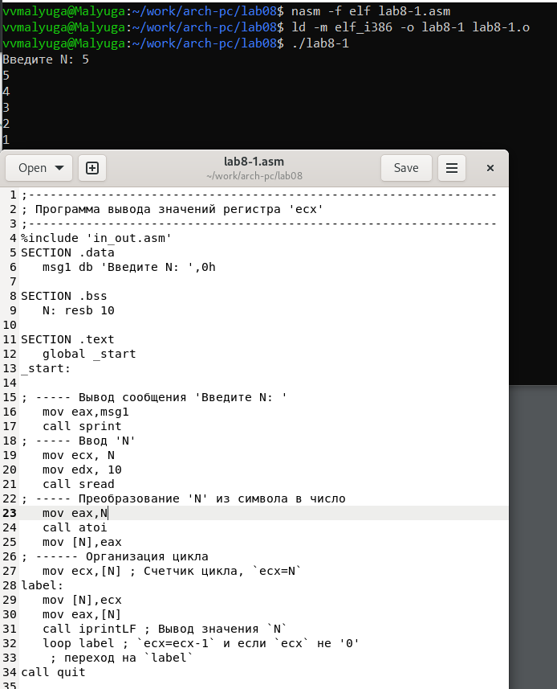
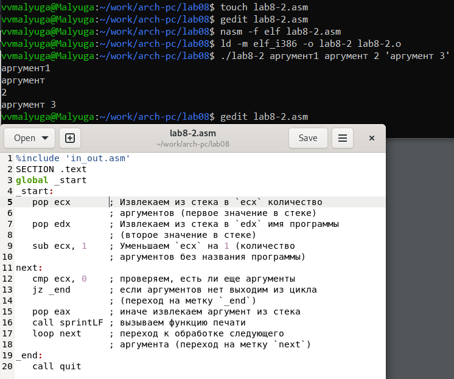
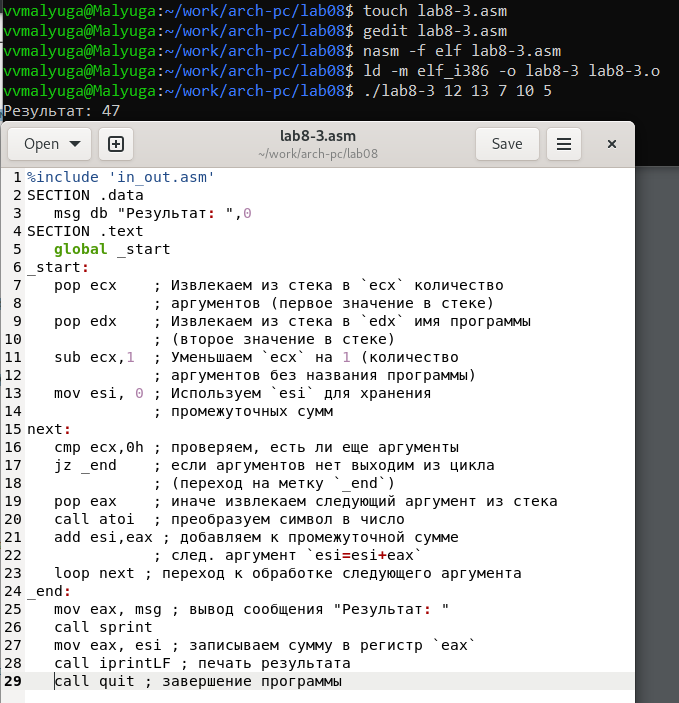

---
## Front matter
title: "Лабораторная работа №8"
subtitle: "Дисциплина: Архитектура компьютера"
author: "Малюга Валерия Васильевна"

## Generic otions
lang: ru-RU
toc-title: "Содержание"

## Bibliography
bibliography: bib/cite.bib
csl: pandoc/csl/gost-r-7-0-5-2008-numeric.csl

## Pdf output format
toc: true # Table of contents
toc-depth: 2
lof: true # List of figures
fontsize: 12pt
linestretch: 1.5
papersize: a4
documentclass: scrreprt
## I18n polyglossia
polyglossia-lang:
  name: russian
  options:
	- spelling=modern
	- babelshorthands=true
polyglossia-otherlangs:
  name: english
## I18n babel
babel-lang: russian
babel-otherlangs: english
## Fonts
mainfont: PT Serif
romanfont: PT Serif
sansfont: PT Sans
monofont: PT Mono
mainfontoptions: Ligatures=TeX
romanfontoptions: Ligatures=TeX
sansfontoptions: Ligatures=TeX,Scale=MatchLowercase
monofontoptions: Scale=MatchLowercase,Scale=0.9
## Biblatex
biblatex: true
biblio-style: "gost-numeric"
biblatexoptions:
  - parentracker=true
  - backend=biber
  - hyperref=auto
  - language=auto
  - autolang=other*
  - citestyle=gost-numeric
## Pandoc-crossref LaTeX customization
figureTitle: "Рис."
tableTitle: "Таблица"
listingTitle: "Листинг"
lofTitle: "Список иллюстраций"
lolTitle: "Листинги"
## Misc options
indent: true
header-includes:
  - \usepackage{indentfirst}
  - \usepackage{float} # keep figures where there are in the text
  - \floatplacement{figure}{H} # keep figures where there are in the text
---


# Цель работы

  Приобретение навыков написания программ с использованием циклов и обработкой аргументов командной строки.  

# Задание
 
1. Реализация циклов в NASM  
2. Обработка аргументов командной строки  
3. Задание для самостоятельной работы  

# Теоретическое введение

  Стек — это структура данных, организованная по принципу LIFO («Last In — First Out») или «последним пришёл — первым ушёл»). Стек является частью архитектуры процессора и реализован на аппаратном уровне. Для работы со стеком в процессоре есть специальные регистры (ss, bp, sp) и команды. Основной функцией стека является функция сохранения адресов возврата и передачи аргументов при вызове процедур. Кроме того, в нём выделяется память для локальных переменных и могут временно храниться значения регистров.  
  Стек имеет вершину, адрес последнего добавленного элемента, который хранится в регистре esp (указатель стека). Противоположный конец стека называется дном. Значение, помещённое в стек последним, извлекается первым. При помещении значения в стек указатель стека уменьшается, а при извлечении — увеличивается.  

  Команда push размещает значение в стеке, т.е. помещает значение в ячейку памяти, на которую указывает регистр esp, после этого значение регистра esp увеличивается на 4. Данная команда имеет один операнд — значение, которое необходимо поместить в стек.   
  Команда pop извлекает значение из стека, т.е. извлекает значение из ячейки памяти, на которую указывает регистр esp, после этого уменьшает значение регистра esp на 4. У этой команды также один операнд, который может быть регистром или переменной в памяти. Нужно помнить, что извлечённый из стека элемент не стирается из памяти и остаётся как “мусор”, который будет перезаписан при записи нового значения в стек.  

  Для организации циклов существуют специальные инструкции. Для всех инструкций максимальное количество проходов задаётся в регистре ecx. Наиболее простой является инструкция loop. Она позволяет организовать безусловный цикл.  

# Выполнение лабораторной работы

## Реализация циклов в NASM

  Создала каталог для программ лабораторной работы № 8, перешла в него и создала файл lab8-1.asm (рис. @fig:001).  

{#fig:001 width=70%}  

  Ввела в файл lab8-1.asm текст программы из листинга 8.1. Создала исполняемый файл и проверила его работу (рис. @fig:002). Программа работает корректно, выводит числа от N до 1 включительно.  

{#fig:002 width=70%}  

  Изменила текст программы, добавив изменение значение регистра ecx в цикле. Создала исполняемый файл и проверила его работу (рис. @fig:003). В данном случае число проходов цикла не соответствует введенному с клавиатуры значению.  

{#fig:003 width=70%}  
 
  Внесла изменения в текст программы, добавив команды push и pop (добавления в стек и извлечения из стека) для сохранения значения счетчика цикла loop (рис. @fig:004). Создала исполняемый файл и проверила его работу. В данном случае число проходов цикла соответствует введенному с клавиатуры значению и выводит числа от N-1 до 0 включительно.  

{#fig:004 width=70%}  
 
## Обработка аргументов командной строки

  Создала файл lab8-2.asm в каталоге work/arch-pc/lab08 и ввела в него текст программы из листинга 8.2. Создала исполняемый файл и запустила его, указав аргументы: аргумент1 аргумент 2 'аргумент 3' (рис. @fig:005). В данном случае программой было обработано 4 аргумента.  

{#fig:005 width=70%}  

  Создала файл lab8-3.asm в каталоге work/arch-pc/lab08 и ввела в него текст программы из листинга 8.3. Создала исполняемый файл и запустила его, указав аргументы: 12 13 7 10 5 (рис. @fig:006).  

{#fig:006 width=70%}  

  Изменила текст программы из листинга 8.3 для вычисления произведения аргументов командной строки (рис. @fig:007). Для этого в 13 строке изменила изначальное значение счетчика на 1, в 21 строке изменила add на imul.  
  Прилагаю код:
  
```NASM 
%include 'in_out.asm'
SECTION .data
   msg db "Результат: ",0
SECTION .text
   global _start
_start:
   pop ecx    ; Извлекаем из стека в `ecx` количество аргументов (первое значение в стеке)
   pop edx    ; Извлекаем из стека в `edx` имя программы (второе значение в стеке)
   sub ecx,1  ; Уменьшаем `ecx` на 1 (количество аргументов без названия программы)
   mov esi, 1 ; Используем `esi` для хранения промежуточного результата
next:
   cmp ecx,0h    ; проверяем, есть ли еще аргументы
   jz _end       ; если аргументов нет выходим из цикла (переход на метку `_end`)
   pop eax       ; иначе извлекаем следующий аргумент из стека
   call atoi     ; преобразуем символ в число
   imul esi, eax ; умножаем промежуточный результат на след. аргумент `esi=esi*eax`
   loop next     ; переход к обработке следующего аргумента
_end:
   mov eax, msg    ; вывод сообщения "Результат: "
   call sprint
   mov eax, esi    ; записываем сумму в регистр `eax`
   call iprintLF   ; печать результата
   call quit       ; завершение программы
```

{#fig:007 width=70%}  


## Задание для самостоятельной работы

  Написала программу, которая находит сумму значений функции f(x) = 15x + 2 (Вариант 11) для x = x1, x2, ..., xn. Создала исполняемый файл и проверила его работу на нескольких наборах x = x1, x2, ..., xn (рис. @fig:008).  

{#fig:008 width=70%}  

  Прилагаю код:  

```NASM
%include 'in_out.asm'
SECTION .data
   msg db "Результат: ",0
SECTION .text
   global _start
_start:
   pop ecx    ; Извлекаем из стека в `ecx` количество
              ; аргументов (первое значение в стеке)
   pop edx    ; Извлекаем из стека в `edx` имя программы
              ; (второе значение в стеке)
   sub ecx,1  ; Уменьшаем `ecx` на 1 (количество
              ; аргументов без названия программы)
   mov esi, 0 ; Используем `esi` для хранения
              ; промежуточных сумм
next:
   cmp ecx,0h ; проверяем, есть ли еще аргументы
   jz _end    ; если аргументов нет выходим из цикла
              ; (переход на метку `_end`)
   pop eax    ; иначе извлекаем следующий аргумент из стека
   call atoi  ; преобразуем символ в число
   
   imul eax, 15    ; умножаем x на 15
   add eax, 2      ; добавляем 2 
   add esi,eax     ; добавляем значение функции для 
                   ; конкретного аргумента к промежуточной сумме
   loop next       ; переход к обработке следующего аргумента
_end:
   mov eax,msg    ; вывод сообщения "Результат: "
   call sprint
   mov eax,esi    ; записываем сумму в регистр `eax`
   call iprintLF  ; печать результата
   call quit      ; завершение программы
```

# Выводы
    
Благодаря данной лабораторной работе я приобрела навыки написания программ использованием циклов и обработкой аргументов командной строки, что поможет мне при выполнении последующих лабораторных работ.  

