---
## Front matter
title: "Лабораторная работа №9"
subtitle: "Дисциплина: Архитектура компьютера"
author: "Малюга Валерия Васильевна"

## Generic otions
lang: ru-RU
toc-title: "Содержание"

## Bibliography
bibliography: bib/cite.bib
csl: pandoc/csl/gost-r-7-0-5-2008-numeric.csl

## Pdf output format
toc: true # Table of contents
toc-depth: 2
lof: true # List of figures
fontsize: 12pt
linestretch: 1.5
papersize: a4
documentclass: scrreprt
## I18n polyglossia
polyglossia-lang:
  name: russian
  options:
	- spelling=modern
	- babelshorthands=true
polyglossia-otherlangs:
  name: english
## I18n babel
babel-lang: russian
babel-otherlangs: english
## Fonts
mainfont: PT Serif
romanfont: PT Serif
sansfont: PT Sans
monofont: PT Mono
mainfontoptions: Ligatures=TeX
romanfontoptions: Ligatures=TeX
sansfontoptions: Ligatures=TeX,Scale=MatchLowercase
monofontoptions: Scale=MatchLowercase,Scale=0.9
## Biblatex
biblatex: true
biblio-style: "gost-numeric"
biblatexoptions:
  - parentracker=true
  - backend=biber
  - hyperref=auto
  - language=auto
  - autolang=other*
  - citestyle=gost-numeric
## Pandoc-crossref LaTeX customization
figureTitle: "Рис."
tableTitle: "Таблица"
listingTitle: "Листинг"
lofTitle: "Список иллюстраций"
lolTitle: "Листинги"
## Misc options
indent: true
header-includes:
  - \usepackage{indentfirst}
  - \usepackage{float} # keep figures where there are in the text
  - \floatplacement{figure}{H} # keep figures where there are in the text
---


# Цель работы

  Приобретение навыков написания программ с использованием подпрограмм. Знакомство с методами отладки при помощи GDB и его основными возможностями.  

# Задание

1. Реализация подпрограмм в NASM
2. Отладка программ с помощью GDB
3. Добавление точек остановки
4. Работа с данными программы в GDB
5. Обработка аргументов командной строки в GDB
6. Задания для самостоятельной работы

# Теоретическое введение

  Отладка — это процесс поиска и исправления ошибок в программе. Отладчики позволяют управлять ходом выполнения программы, контролировать и изменять данные. Это помогает быстрее найти место ошибки в программе и ускорить её исправление. Наиболее популярные способы работы с отладчиком — это использование точек останова и выполнение программы по шагам.  
  GDB (GNU Debugger — отладчик проекта GNU) работает на многих UNIXподобных системах и умеет производить отладку многих языков программирования. GDB предлагает обширные средства для слежения и контроля за выполнением компьютерных программ. Отладчик не содержит собственного графического пользовательского интерфейса и использует стандартный текстовый интерфейс консоли. Однако для GDB существует несколько сторонних графических надстроек, а кроме того, некоторые интегрированные среды разработки используют его в качестве базовой подсистемы отладки.  
  Отладчик GDB (как и любой другой отладчик) позволяет увидеть, что происходит «внутри» программы в момент её выполнения или что делает программа в момент сбоя.  
  Команда run (сокращённо r) — запускает отлаживаемую программу в оболочке GDB.  
  Команда kill (сокращённо k) прекращает отладку программы, после чего следует вопрос о прекращении процесса отладки. Если в ответ введено y (то есть «да»), отладка программы прекращается. Командой run её можно начать заново, при этом все точки останова (breakpoints), точки просмотра (watchpoints) и точки отлова (catchpoints) сохраняются.  
  Для выхода из отладчика используется команда quit (или сокращённо q).  
  Если есть файл с исходным текстом программы, а в исполняемый файл включена информация о номерах строк исходного кода, то программу можно отлаживать, работая в отладчике непосредственно с её исходным текстом. Чтобы программу можно было отлаживать на уровне строк исходного кода, она должна быть откомпилирована с ключом -g.  
  Установить точку останова можно командой break (кратко b). Типичный аргумент этой команды — место установки. Его можно задать как имя метки или как адрес. Чтобы не было путаницы с номерами, перед адресом ставится «звёздочка».  
  Информацию о всех установленных точках останова можно вывести командой info (кратко i).  
  Для того чтобы сделать неактивной какую-нибудь ненужную точку останова, можно воспользоваться командой disable.  
  Обратно точка останова активируется командой enable.  
  Если же точка останова в дальнейшем больше не нужна, она может быть удалена с помощью команды delete.  
  Для продолжения остановленной программы используется команда continue (c). Выполнение программы будет происходить до следующей точки останова.  
  В качестве аргумента может использоваться целое число N, которое указывает отладчику проигнорировать N − 1 точку останова (выполнение остановится на N-й точке).  
  Команда stepi (кратко si) позволяет выполнять программу по шагам, т.е. данная команда выполняет ровно одну инструкцию.  
  Подпрограмма — это, как правило, функционально законченный участок кода, который можно многократно вызывать из разных мест программы. В отличие от простых переходов из подпрограмм существует возврат на команду, следующую за вызовом. Если в программе встречается одинаковый участок кода, его можно оформить в виде подпрограммы, а во всех нужных местах поставить её вызов. При этом подпрограмма будет содержаться в коде в одном экземпляре, что позволит уменьшить размер кода всей программы.  
  Для вызова подпрограммы из основной программы используется инструкция call, которая заносит адрес следующей инструкции в стек и загружает в регистр eip адрес соответствующей подпрограммы, осуществляя таким образом переход. Затем начинается выполнение подпрограммы, которая, в свою очередь, также может содержать подпрограммы. Подпрограмма завершается инструкцией ret, которая извлекает из стека адрес, занесённый туда соответствующей инструкцией call, и заносит его в eip. После этого выполнение основной программы возобновится с инструкции, следующей за инструкцией call.  


# Выполнение лабораторной работы

## Реализация подпрограмм в NASM

  Создала каталог для программ лабораторной работы № 9, перешла в него и создала файл lab09-1.asm. Ввела в файл lab09-1.asm текст программы из листинга 9.1. Создала исполняемый файл и проверила его работу (рис. @fig:001).  

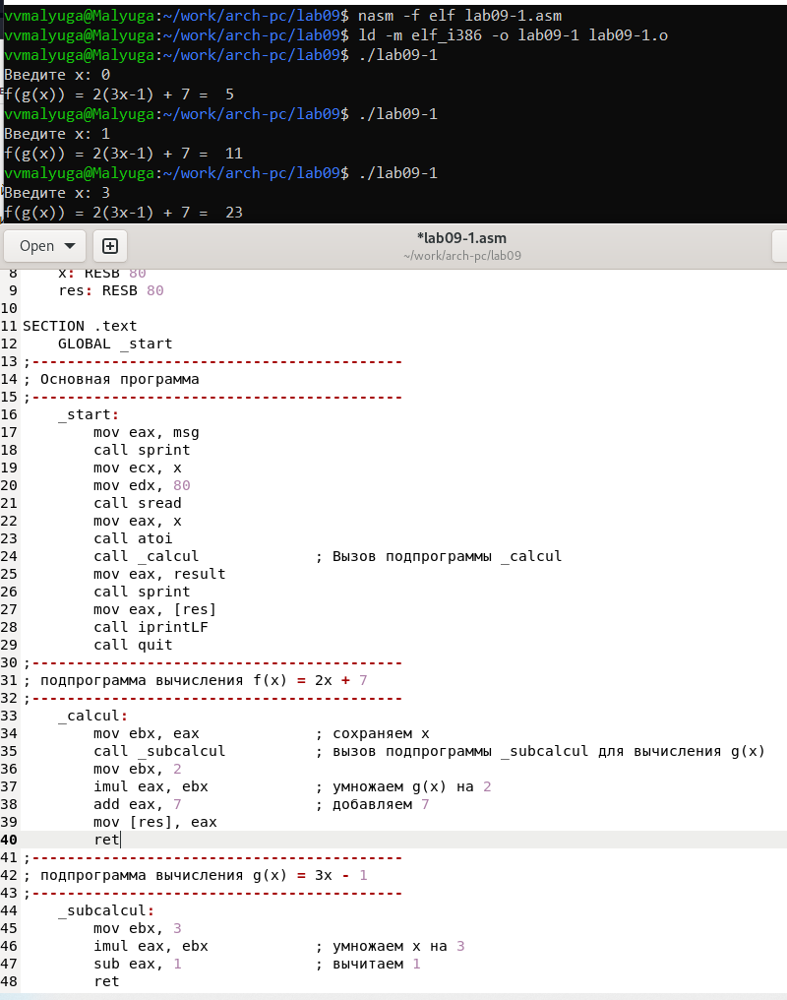{#fig:001 width=70%}  
  
  Изменила текст программы, добавив подпрограмму _subcalcul в подпрограмму _calcul, для вычисления выражения f(g(x)), где x вводится с клавиатуры, f(x) = 2x + 7, g(x) = 3x − 1. X передается в подпрограмму _calcul, из нее в подпрограмму _subcalcul, где вычисляется выражение g(x), результат возвращается в _calcul и вычисляется выражение f(g(x)). Результат возвращается в основную программу для вывода результата на экран (рис. @fig:002).  

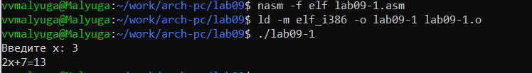{#fig:002 width=70%}  

  Прилагаю код:  
  
```NASM
%include 'in_out.asm'
SECTION .data
    msg: DB 'Введите x: ', 0
    result: DB 'f(g(x)) = 2(3x-1) + 7 =  ', 0
SECTION .bss
    x: RESB 80
    res: RESB 80
SECTION .text
    GLOBAL _start
;------------------------------------------
; Основная программа
;------------------------------------------
    _start:
        mov eax, msg
        call sprint
        mov ecx, x
        mov edx, 80
        call sread
        mov eax, x
        call atoi
        call _calcul             ; Вызов подпрограммы _calcul
        mov eax, result
        call sprint
        mov eax, [res]
        call iprintLF
        call quit
;------------------------------------------
; подпрограмма вычисления f(x) = 2x + 7
;------------------------------------------
    _calcul:
        mov ebx, eax             ; сохраняем x
        call _subcalcul          ; вызов подпрограммы _subcalcul для вычисления g(x)
        mov ebx, 2
        imul eax, ebx            ; умножаем g(x) на 2
        add eax, 7               ; добавляем 7
        mov [res], eax
        ret
;------------------------------------------
; подпрограмма вычисления g(x) = 3x - 1
;------------------------------------------
    _subcalcul:
        mov ebx, 3
        imul eax, ebx            ; умножаем x на 3
        sub eax, 1               ; вычитаем 1
        ret
```

## Отладка программ с помощью GDB

  Создала файл lab09-2.asm с текстом программы из Листинга 9.2. (Программа печати сообщения Hello world!). Получила исполняемый файл. Загрузила исполняемый файл в отладчик gdb. Проверила работу программы, запустив ее в оболочке GDB с помощью команды run. Для более подробного анализа программы установила брейкпоинт на метку _start, с которой начинается выполнение любой ассемблерной программы, и запустила её (рис. @fig:003).  

{#fig:003 width=70%}  

  Посмотрела дисассимилированный код программы с помощью команды disassemble начиная с метки _start. Переключилась на отображение команд с Intel’овским синтаксисом, введя команду setdisassembly-flavor intel (рис. @fig:004).  

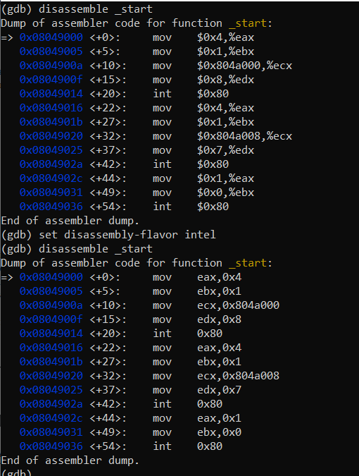{#fig:004 width=70%}  

  Различия отображения синтаксиса машинных команд в режимах ATT и Intel:
  В режиме ATT имена регистров начинаются с символа %, а имена операндов с $, в то время как в Intel используется привычный нам синтаксис.  
  
  Включила режим псевдографики для более удобного анализа программы (рис. @fig:005).  

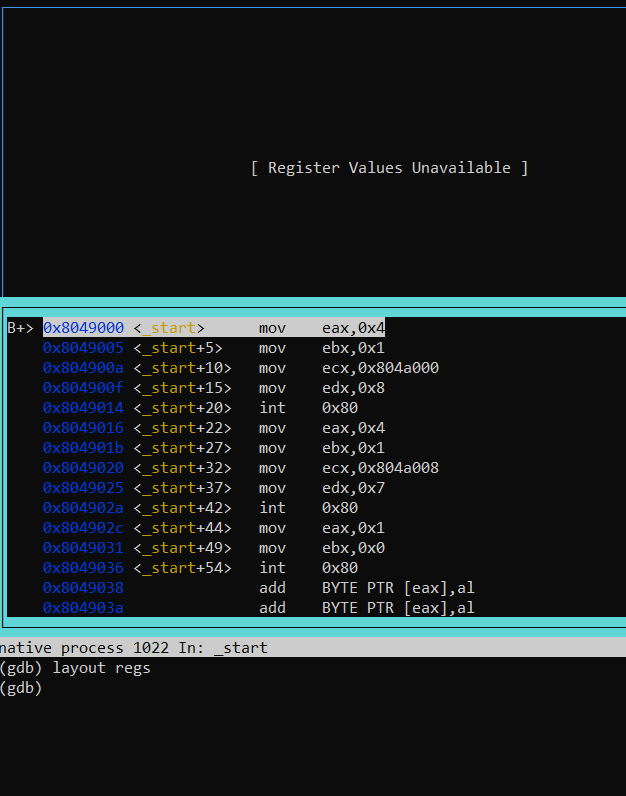{#fig:005 width=70%}  


### Добавление точек останова

  Проверяю, что точка останова по имени метки _start установлена с помощью команды info breakpoints и устанавливаю еще одну точку останова по адресу инструкции mov ebx,0x0. Просматриваю информацию о всех установленных точках останова (рис. @fig:006).  

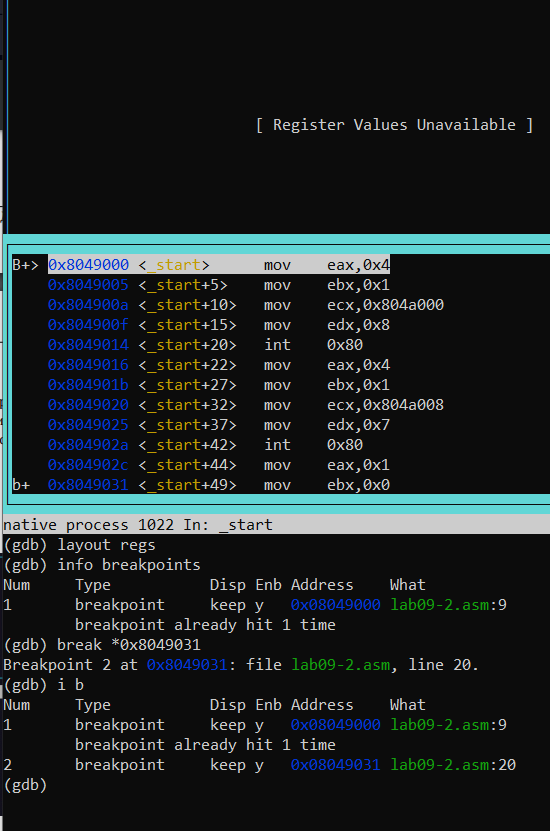{#fig:006 width=70%}  

### Работа с данными программы в GDB

  Выполнила 5 инструкций с помощью команды stepi и проследила за изменением значений регистров (рис. @fig:007). Изменились значения регистров eax, ecx, edx и ebx.  

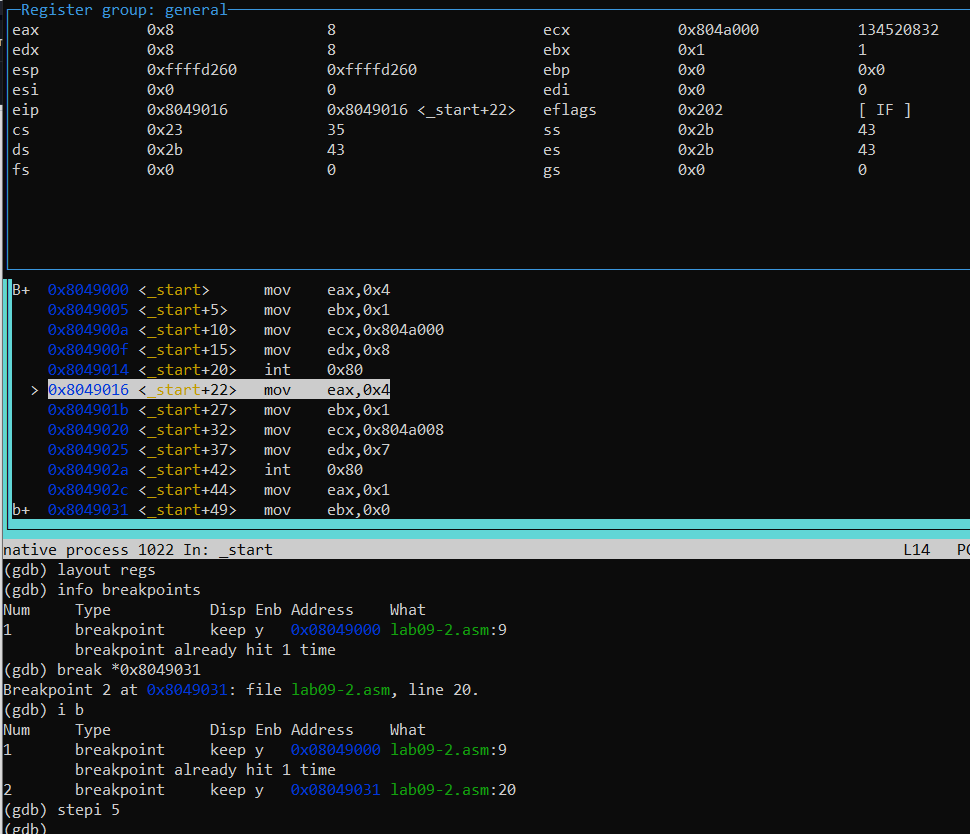{#fig:007 width=70%}  

  С помощью команды x/1sb &msg1 просмотрела значение переменной msg1 и значение переменной msg2 по ее адресу (рис. @fig:008).  

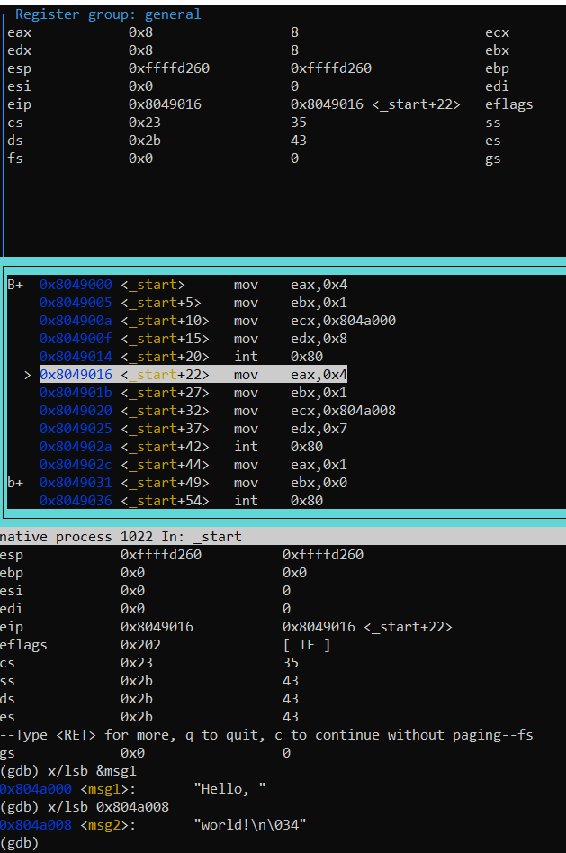{#fig:008 width=70%}  

  С помощью команды set изменила первый символ переменной msg1 и заменила первый символ в переменной msg2 (рис. @fig:009).  

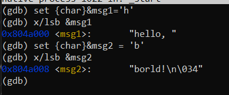{#fig:009 width=70%}  
  
  Вывела в шестнадцатеричном формате, в двоичном формате и в символьном виде соответственно значение регистра edx с помощью команды print p/F $val (рис. @fig:010).  

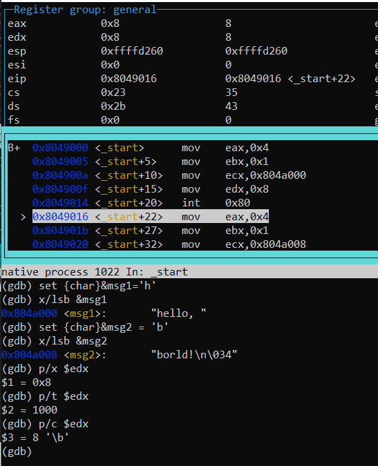{#fig:010 width=70%}  

  С помощью команды set изменила значение регистра ebx в соответствии с заданием (рис. @fig:012).  

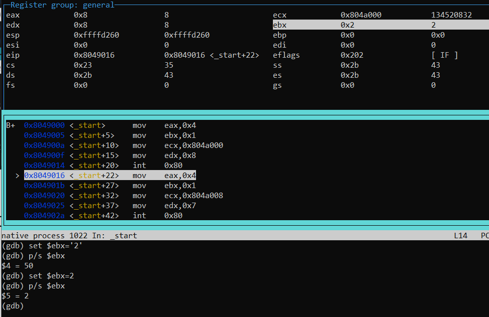{#fig:012 width=70%}  

  Разница вывода команд p/s $ebx отличается тем, что в первом случае мы переводим символ в его строковый вид, а во втором случае число в строковом виде не изменяется. Завершаю выполнение программы с помощью команды continue и выхожу из GDB с помощью команды quit (рис. @fig:013).  

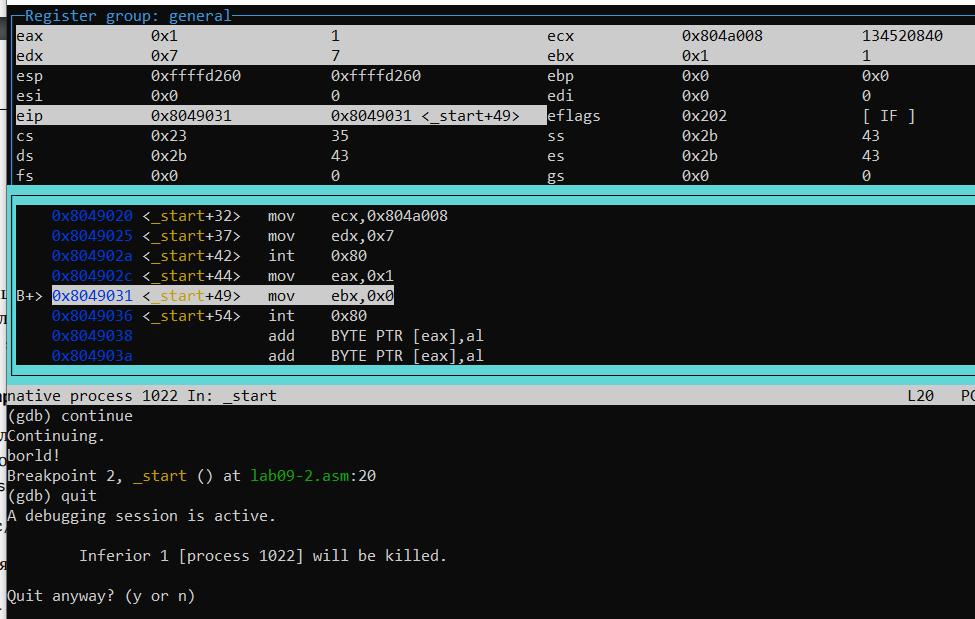{#fig:013 width=70%}  

### Обработка аргументов командной строки в GDB

  Скопировала файл lab8-2.asm с программой из листинга 8.2 в файл с именем lab09-3.asm и создала исполняемый файл (рис. @fig:014).  

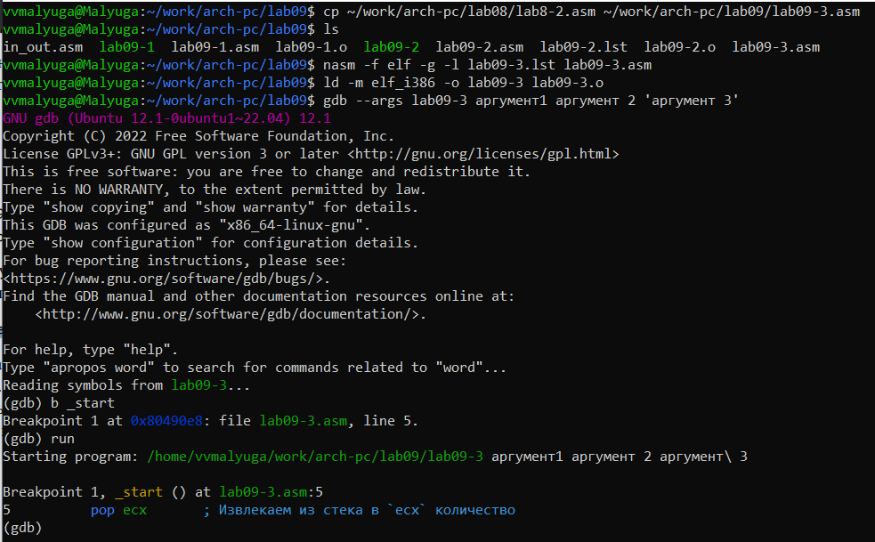{#fig:014 width=70%}  

  Посмотрела вершину стека и позиции стека по их адресам (рис. @fig:015). Шаг изменения адреса равен 4, т.к количество аргументов командной строки равно 4.  

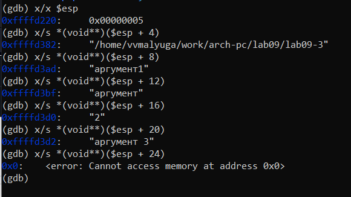{#fig:015 width=70%}  

  
## Задание для самостоятельной работы

  1. Преобразовала программу из лабораторной работы №8 (Задание №1 для самостоятельной работы), реализовав вычисление значения функции 𝑓(𝑥) как подпрограмму (рис. @fig:016).  

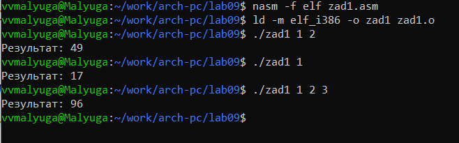{#fig:016 width=70%}  
  
  Прилагаю код:  
  
```NASM
%include 'in_out.asm'
SECTION .data
   msg db "Результат: ", 0
SECTION .text
   global _start
_calcul:
   imul eax, 15    ; умножаем x на 15
   add eax, 2      ; добавляем 2 
   ret
_start:
   pop ecx         ; Извлекаем из стека в `ecx` количество
                   ; аргументов (первое значение в стеке)
   pop edx         ; Извлекаем из стека в `edx` имя программы
                   ; (второе значение в стеке)
   sub ecx, 1      ; Уменьшаем `ecx` на 1 (количество
                   ; аргументов без названия программы)
   mov esi, 0      ; Используем `esi` для хранения
                   ; промежуточных сумм
next:
   cmp ecx, 0h     ; проверяем, есть ли еще аргументы
   jz _end         ; если аргументов нет, выходим из цикла
                   ; (переход на метку `_end`)
   pop eax         ; иначе извлекаем следующий аргумент из стека
   call atoi       ; преобразуем символ в число
   call _calcul    ; вызываем подпрограмму для вычисления f(x)
   add esi, eax    ; добавляем значение функции для 
                   ; конкретного аргумента к промежуточной сумме
   loop next       ; переход к обработке следующего аргумента
_end:
   mov eax, msg    ; вывод сообщения "Результат: "
   call sprint
   mov eax, esi    ; записываем сумму в регистр `eax`
   call iprintLF  ; печать результата
   call quit      ; завершение программы
```

  2. Ввела в файл zad2.asm текст программы из листинга 9.3. При корректной работе программы должно выводится “25”. Создала исполняемый файл и запустила его. Получили неверный ответ: 10 (рис. @fig:017).  
  
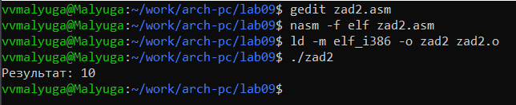{#fig:017 width=70%}  
  
  Получила исполняемый файл для работы с GDB, запустила его и поставила брейкпоинт на _start. Затем включила режим псевдографики (рис. @fig:018).  
  
{#fig:018 width=70%}  
  
  С помощью команды stepi проследила за изменениями значений регистров в течение выполнении программы. После пятой команды (строка mul ecx) заметила, что происходит умножение ecx на eаx, то есть 4 на 2, вместо умножения 4 на 5 (регистр ebx) (рис. @fig:019).  
  
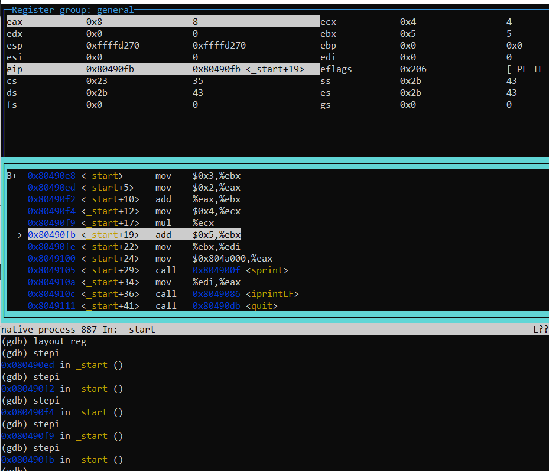{#fig:019 width=70%}  

  Исправила код таким образом: добавила после add ebx,eax команду mov eax,ebx и заменила ebx на eax в инструкциях add ebx,5 и mov edi,ebx. 
    
  Создала исполняемый файл и запустила его (рис. @fig:020). Теперь программы работает корректно.

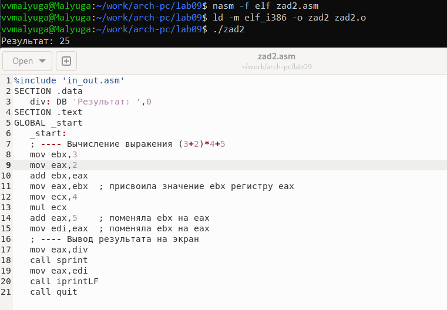{#fig:020 width=70%}  

  Прилагаю код:  
  
```NASM
%include 'in_out.asm'
SECTION .data
   div: DB 'Результат: ',0
SECTION .text
GLOBAL _start
   _start:
   ; ---- Вычисление выражения (3+2)*4+5
   mov ebx,3
   mov eax,2
   add ebx,eax
   mov eax,ebx  ; присвоила значение ebx регистру eax 
   mov ecx,4
   mul ecx
   add eax,5    ; поменяла ebx на eax 
   mov edi,eax  ; поменяла ebx на eax
   ; ---- Вывод результата на экран
   mov eax,div
   call sprint
   mov eax,edi
   call iprintLF
   call quit
```

# Выводы
    
  Во время выполнения данной лабораторной работы я приобрела навыки написания программ с использованием подпрограмм и ознакомилась с методами отладки при помощи GDB и его основными возможностями.  
