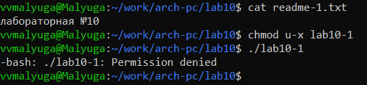

---
## Front matter
title: "Лабораторная работа №10"
subtitle: "Дисциплина: Архитектура компьютера"
author: "Малюга Валерия Васильевна"

## Generic otions
lang: ru-RU
toc-title: "Содержание"

## Bibliography
bibliography: bib/cite.bib
csl: pandoc/csl/gost-r-7-0-5-2008-numeric.csl

## Pdf output format
toc: true # Table of contents
toc-depth: 2
lof: true # List of figures
fontsize: 12pt
linestretch: 1.5
papersize: a4
documentclass: scrreprt
## I18n polyglossia
polyglossia-lang:
  name: russian
  options:
	- spelling=modern
	- babelshorthands=true
polyglossia-otherlangs:
  name: english
## I18n babel
babel-lang: russian
babel-otherlangs: english
## Fonts
mainfont: PT Serif
romanfont: PT Serif
sansfont: PT Sans
monofont: PT Mono
mainfontoptions: Ligatures=TeX
romanfontoptions: Ligatures=TeX
sansfontoptions: Ligatures=TeX,Scale=MatchLowercase
monofontoptions: Scale=MatchLowercase,Scale=0.9
## Biblatex
biblatex: true
biblio-style: "gost-numeric"
biblatexoptions:
  - parentracker=true
  - backend=biber
  - hyperref=auto
  - language=auto
  - autolang=other*
  - citestyle=gost-numeric
## Pandoc-crossref LaTeX customization
figureTitle: "Рис."
tableTitle: "Таблица"
listingTitle: "Листинг"
lofTitle: "Список иллюстраций"
lolTitle: "Листинги"
## Misc options
indent: true
header-includes:
  - \usepackage{indentfirst}
  - \usepackage{float} # keep figures where there are in the text
  - \floatplacement{figure}{H} # keep figures where there are in the text
---


# Цель работы

  Приобретение навыков написания программ для работы с файлами.  
  
# Задание

1. Написание программ для работы с файлами.
2. Задание для самостоятельной работы.

# Теоретическое введение
  
  Права доступа определяют набор действий (чтение, запись, выполнение), разрешённых для выполнения пользователям системы над файлами. Для каждого файла пользователь может входить в одну из трех групп: владелец, член группы владельца, все остальные. Для каждой из этих групп может быть установлен свой набор прав доступа.  
  Для изменения прав доступа служит команда chmod, которая понимает как символьное, так и числовое указание прав.  
  Обработка файлов в операционной системе Linux осуществляется за счет использования определенных системных вызовов. Для корректной работы и доступа к файлу при его открытии или создании, файлу присваивается уникальный номер (16-битное целое число) – дескриптор файла.  
  Для создания и открытия файла служит системный вызов sys_creat, который использует следующие аргументы: права доступа к файлу в регистре ECX, имя файла в EBX и номер системного вызова sys-creat (8) в EAX.  
  Для открытия существующего файла служит системный вызов sys_open, который использует следующие аргументы: права доступа к файлу в регистре EDX, режим доступа к файлу в регистр ECX, имя файла в EBX и номер системного вызова sys-open (5) в EAX.  
  Для записи в файл служит системный вызов sys_write, который использует следующие аргументы: количество байтов для записи в регистре EDX, строку содержимого для записи ECX, файловый дескриптор в EBX и номер системного вызова sys-write (4) в EAX. Системный вызов возвращает фактическое количество записанных байтов в регистр EAX. В случае ошибки, код ошибки также будет находиться в регистре EAX. Прежде чем записывать в файл, его необходимо создать или открыть, что позволит получить дескриптор файла.  
  Для чтения данных из файла служит системный вызов sys_read, который использует следующие аргументы:   количество байтов для чтения в регистре EDX, адрес в памяти для записи прочитанных данных в ECX, файловый дескриптор в EBX и номер системного вызова sys-read (3) в EAX. Как и для записи, прежде чем читать из файла, его необходимо открыть, что позволит получить дескриптор файла.  
  Для правильного закрытия файла служит системный вызов sys_close, который использует один аргумент – дескриптор файла в регистре EBX. После вызова ядра происходит удаление дескриптора файла, а в случае ошибки, системный вызов возвращает код ошибки в регистр EAX.  
  Для изменения содержимого файла служит системный вызов sys_lseek, который использует следующие аргументы: исходная позиция для смещения EDX, значение смещения в байтах в ECX, файловый дескриптор в EBX и номер системного вызова sys_lseek (19) в EAX. Значение смещения можно задавать в байтах.  
  Удаление файла осуществляется системным вызовом sys_unlink, который использует один аргумент – имя файла в регистре EBX.  

# Выполнение лабораторной работы

## Написание программ для работы с файлами

  Создала каталог для программ лабораторной работы № 10, перешла в него и создала файлы lab10-1.asm, readme-1.txt и readme-2.txt. Ввела в файл lab10-1.asm текст программы из листинга 10.1. Создала исполняемый файл и проверила его работу (рис. @fig:001).  

{#fig:001 width=70%}  
 
  С помощью команды chmod u-x изменила права доступа к исполняемому файлу lab10-1, запретив его выполнение. Попыталась выполнить файл. Объяснение результата: файл не выполняется, т.к в команде я указала “u” - владелец (себя), “-” - отменить набор прав, “х” - право на исполнение (рис. @fig:002).  

{#fig:002 width=70%}  
 
  С помощью команды chmod u+x изменила права доступа к файлу lab10-1.asm с исходным
текстом программы, добавив права на исполнение. Попыталась выполнить его. Объяснение результата: текстовый файл начинает исполнение, но не исполняется, т.к не содержит в себе команд для терминала (рис. @fig:003).  

{#fig:003 width=70%}  

  В соответствии со своим вариантом (11) предоставила права доступа к файлу readme1.txt представленные в символьном виде, а для файла readme-2.txt – в двочном виде: --x r-- -w- 000 100 111. Проверила правильность выполнения с помощью команды ls -l (рис. @fig:004).  

{#fig:004 width=70%}  

## Задание для самостоятельной работы

  Написала программу работающую по следующему алгоритму:  
  
+ Вывод приглашения “Как Вас зовут?”
+ ввести с клавиатуры свои фамилию и имя
+ создать файл с именем name.txt
+ записать в файл сообщение “Меня зовут”
+ дописать в файл строку введенную с клавиатуры
+ закрыть файл

  Создала исполняемый файл и проверила его работу. Проверила наличие файла и его
содержимое с помощью команд ls и cat (рис. @fig:005).  

{#fig:005 width=70%}  
  
  Прилагаю код:

```NASM
%include 'in_out.asm'
SECTION .data
    msg1 db 'Как Вас зовут?', 0
    filename db 'name.txt', 0
    msg2 db 'Меня зовут ', 0
SECTION .bss
    name resb 255
SECTION .text
global _start
_start:
                  ; вывод приглашения
    mov eax, msg1
    call sprintLF
                  ; ввод с клавиатуры
    mov ecx, name
    mov edx, 255
    call sread
                  ; создание и открытие файла
    mov ecx, 0777o
    mov ebx, filename
    mov eax, 8
    int 0x80
    mov esi, eax
                  ; вывод строки "Меня зовут"
    mov eax, msg2
    call slen
    mov edx, eax
    mov ecx, msg2
    mov ebx, esi
    mov eax, 4
    int 0x80
                  ; вывод введенного имени
    mov eax, name
    call slen
    mov edx, eax
    mov ecx, name
    mov ebx, esi
    mov eax, 4
    int 0x80
                  ; закрытие файла
    mov ebx, esi
    mov eax, 6
    int 0x80
    call quit

```

# Выводы
    
  Благодаря данной лабораторной работе я приобрела навыки написания программ для работы с файлами.  
